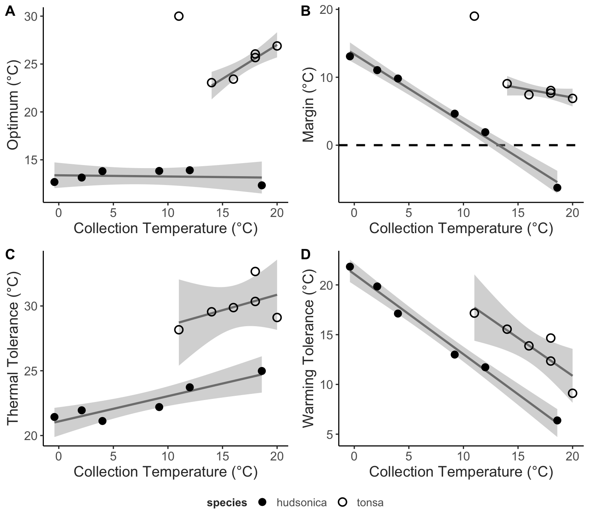

# Introduction

Heatwaves are increasing in frequency and intensity in aquatic ecosystems (Frölicher et al. 2018; Oliver et al. 2018, 2019) (Streams and rivers REF). These periods of anomalously high temperatures present severe challenges to marine biota (Smale et al. 2019), and both lethal and non-lethal temperature effects on organisms have strong potential to alter community composition and ecosystem functions (Truong 2022 REF). The effects on community dynamics are determined in part by the relative vulnerabilities of component taxa (REF). In order to predict how communities may respond to both long-term warming and the increasing effects of heatwaves, there is an urgent need to understand what determines relative vulnerability to heatwaves.

Most previous studies have focused on the direct effects of increased temperature on organisms and population dynamics (REF). Shaped by resulting changes in feeding, competitive ability, reproduction, and survival, increased temperature during a heatwave may have profound effects on community dynamics (REF) and the distribution of organisms (REF). There may also be a wide range of indirect effects of heatwaves on populations, propagated by mechanisms like trans-generational plasticity and maternal effects (Truong 2022 - REF). As both the frequency and duration of heatwaves increases, these indirect effects may be especially important to consider (papers on the benefits of trans-generational effects for events that last a long time (relative to generation time) - REF). While the average duration of marine heatwaves is XXX, autotrophs (e.g. phytoplankton) and primary consumers (e.g. copepods) typically have generation times on the order of days to weeks. As such, heatwaves have strong potential to drive transgenerational responses.

Another important consequence of short generation times, the response of these key groups to heatwaves may vary over seasonal timescales, reflecting either acclimatization or adaptation of thermal performance curves to different seasonal conditions @sasaki2020 (Sasaki and Dam 2020; Adaptive tracking paper). The presence or absence of seasonal variation in thermal performance curves will play an important role in determining the effects of heatwaves on a population (Figure 1). Much of the past work on the effects of heatwaves assumes performance curves are fixed (i.e. - there is no seasonal variation in TPCs). In this case, the effect of heatwaves will vary seasonally as the relative position of environmental temperatures to TPC optimum temperature and lethal thermal limits varies. Alternatively, variation in TPCs over seasonal timescales may act as a buffer against negative effects of heatwaves if optimum temperatures track environmental temperatures, preventing environmental temperatures from exceeding thermal optima. Differences in the magnitude of seasonal variation in TPCs may therefore play a key role in shaping patterns in relative vulnerability of different taxa within a community.


Seasonal variation in TPCs could modify both direct and indirect effects of heatwaves on marine organisms with short generation times, and thus shape the relative vulnerability of different taxa. It is therefore important to consider this temporal variation in predictions about how the increasing threat of heatwaves may affect marine communities. Copepods are an ideal model system to examine these dynamics, as they dominate the planktonic community in many temperate locations and typically have short generation times. By nature of their abundance, copepods are exceptionally ecologically important, and as a result there is pressing need to understand how these organisms may be affected by marine heatwaves. Here we investigate the potential for seasonal variation in thermal performance curves of the ecologically important copepod species *Acartia hudsonica* and *A. tonsa* to buffer populations against negative effects of heatwaves. We examined how thermal performance curves for key fitness related traits (egg production, hatching success, and survivorship) varied over the course of the seasonal temperature cycle. We also quantified both direct and indirect (e.g. - trans-generational) effects of heatwaves on one of the species (*A. tonsa*) in the laboratory using a series of simulated heatwave experiments. We test two hypotheses: 1) there is seasonal variation in the thermal performance curves of key fitness related traits in *A. hudsonica* and *A. tonsa*; and 2) when TPC parameters track changes in environmental temperatures, the effects of simulated heatwaves do not vary over the course of the year. By integrating experiments with field-collected and lab-reared organisms, we show that TPCs of *A. tonsa* but not *A. hudsonica* vary across seasons and that this variation allows the population to maintain a relatively constant margin between optimum temperatures and ambient environmental temperatures. The mechanisms that produce seasonally variable TPCs, whether genetic or plastic, reduced the potential for heatwaves to adversely affect population dynamics and thus increase resilience in the face of climate change.

# Methods

## Generating Field TPCs

Copepods were collected from Long Island Sound, near the University of Connecticut, Avery Point Campus at several times throughout the year using surface tows of a \_ um mesh plankton net. Mature *Acartia hudsonica* or *Acartia tonsa* females were isolated from the contents of the plankton tow and isolated individually in petri dishes for egg production and hatching success assays. During these assays, females were fed \_. Females produced eggs for \_ days, after which the female was removed. Eggs were given three additional days before hatching frequency was assessed. These assays were performed across a range of temperatures (10-30 degrees C for *A. tonsa* and 4-24 degrees C for *A. hudsonica*).

**Will need substantial input from other people to fill in the methods section.**

```{r table1, echo = F}
library(tidyverse)

field_collections = data.frame("Month" = c("January", "February", "March", "April", "May", "June", 
                                           "July", "August", "September", "October", "November 1", "November 2"),
                         "Date" = c("January 21st 2015", "February 21st 2015", "March 16 2015", "April 21st 2015", "May 14th 2015", "June __ 2015",
                                    "July 29th 2014", "August 13th 2014", "September 11th 2014", "October 22nd 2014", "November 4th 2014", "November 19th 2014"),
                         "Temperature" = c(2.1, -0.4, 4, 9.2, 12, 18.6,
                                           20, 18, 18, 16, 14.5, 11),
                         "Species" = rep(c("*Acartia hudsonica*", "*Acartia tonsa*"), each = 6))

knitr::kable(field_collections,
             caption = "Details for the field TPC collections. The date and water temperature at the time of collection is provided for each group, along with which species was collected. The exact date for the June 2015 collection of *Acartia hudsonica* was not available.")
```

TPCs for egg production, hatching success, and production were then generated using the framework outlined by Padfield et al. (2021). Egg production, hatching success, and production data were modeled using a Guassian equation. Parameters (maximum values and thermal optima) were extracted from these model fits. Survivorship was modeled using a logistic regression of individual survivorship against stress temperature and used to estimate thermal tolerance (as LD50, the temperature of 50% mortality).

## Simulated Heat Waves

To test our second hypothesis (that varying thermal performance curve parameters reduce vulnerability to heatwaves) we collected *Acartia tonsa* again in 2015 for use in laboratory simulated heatwave experiments. In order to test the effects of a heatwave against the seasonally shifting baseline of ambient temperature, three collections were made before, during, and after peak environmental temperatures, corresponding to late June, late July, and early December (Table 2). These experiments examined both direct and indirect (e.g. transgenerational) effects of heatwaves. To examine the direct effects, egg production rate, hatching success, and production were measured for around 60 females per collection split into two groups (control and heatwave). These assays were performed as described in the Field TPC section, with females isolated in individual petri dishes and provided with food *ad libitum*. The control group remained at a temperature near the current ambient temperature in Long Island Sound while the Heatwave group experienced temperatures 5 degrees C above the ambient temperature (Table 3). Traits were measured over two periods to examine the effects of short and long heatwave events - Days 1-3 and Days 5-7, respectively. Females were moved into petri dishes with fresh food solution on Days 3 and 5. Eggs produced in between the two time periods were not examined.

To examine the effect of the simulated heat wave on traits, [STATS]

```{r table2, echo = F}
#|Table 2 - caption 

lab_collections = data.frame("Period" = c("Early", "Mid", "Late"),
  "Date" = c("June 27th 2015", "July 29th 2015", "December 1st 2015"),
                             "Temperature" = c(17.8, 22.4, 12))

exp_design = data.frame("Period" = rep(c("Early", "Mid", "Late"), each = 2),
         "Treatment" = rep(c("Control", "Heatwave")),
         "Temperature" = c(17,22,22,27,12,17)) %>% 
  pivot_wider(names_from = Treatment, values_from = Temperature) %>% 
  inner_join(lab_collections, by = c("Period")) %>% 
  select(Period, Date, "Field Temp." = Temperature, "Control Temp." = Control, "Heatwave Temp." = Heatwave)

knitr::kable(exp_design, 
             caption = "Details for the simulated heatwave collections. The date and water temperature at the time *A. tonsa* individuals were collected from the field is provided for each group, along with the temperatures used for the control and heatwave exposures.")
```

## Transgenerational Experiments

In addition to the individuals maintained in petri dishes to measure direct effects of heatwaves, several hundred adult copepods were also placed into each of eight 4L buckets of filtered seawater and provided with food ad libitum (four each, maintained at control and heatwave temperatures). Water in each bucket was kept oxygenated using a small aquarium pump. Eggs were collected from each bucket following the same schedule as the direct effect experiments - eggs were collected on Day 3 and Day 7 for the short and long heatwave exposures, respectively. Eggs were discarded on Day 5 to ensure all individuals reflected the correct exposure periods. These eggs were then split into three groups which developed at one of three different temperatures (12, 17, or 22 degrees C). After these individuals matured, body size and the three reproductive traits (egg production, hatching success, and production) were measured at the temperature individuals developed at. Within developmental temperatures, differences between the Heatwave and Control treatment groups should reflect the indirect effects of heatwaves: these individuals represent eggs produced by parents experiencing the heatwave conditions, but that developed at the same temperatures as the Control individuals.

[STATS]

# Results

## Seasonal Variation in Field TPCs

There was abundant variation in TPCs for Egg Production Rate (EPR), Hatching Success, and production (the product of Hatching Success and Total Egg Production; the number of hatched offspring per female per day) for copepods collected throughout the year. *Acartia hudsonica* EPR TPCs tended to have lower optima and were less variable than *A. tonsa* EPR TPCs (Figure 2). Within *A. tonsa*, EPR optimum temperatures tended to be higher in warmer months (Figure 3). Hatching success TPCs for *A. hudsonica* were also less variable than those of *A. tonsa*. TPCs for hatching success were also wider in *A. tonsa* than in *A. hudsonica*, maintaining relatively high hatching success across a range of temperatures. *A. tonsa* hatching success was higher, however, in warmer months than cooler months, regardless of incubation temperature. This is especially evident for the second November collection of *A. tonsa*, which exhibited very low hatching success at all but the highest temperatures used in the assays. When combined, the variation in TPC breadth, optimum temperatures, and maximum values for EPR and hatching success curves yielded Production curves that were highly variable in *Acartia tonsa*. Collections from warmer months generally had slightly higher optimum temperatures as well as higher maximum production values, although the narrow hatching success TPC of the second November collection produces a production TPC skewed towards warmer temperatures, going against this trend. Thermal survivorship curves were highly variable, with a LD50 range of around 5 degrees C in both species. As observed in previous studies, *A. tonsa* had higher thermal tolerance than *A. hudsonica* (Sasaki & Dam, 2020). Thermal tolerance increased with collection temperature in both species.

```{r, figure2, echo = F, out.width = "400px"}
#| fig.cap = "CAPTION HERE."
knitr::include_graphics("../Output/Figures/markdown/figure-2-combined-tpcs-1.png")
```

TPC parameters for *A. tonsa* but not *A. hudsonica* were correlated with collection temperature, with the exception of the second November collection of *A. tonsa*, which had the highest production thermal optimum despite being collected at the lowest temperature. Vulnerability to heatwaves was estimated from these performance curves as thermal safety margins for production (the difference between thermal optimum and environmental temperature) and warming tolerance for survivorship (difference between thermal tolerance, LD50, and environmental temperature) (REF - Deutsch paper). The invariant thermal optima for *A. hudsonica* production results in seasonal variation in vulnerability to heatwaves, as illustrated by the decline in thermal safety margin and warming tolerance during later months of its seasonal occurrence (Figure 3). Later in its season of occurrence, environmental temperatures actually exceed the thermal optimum, suggesting that the seasonal distribution of this species may be directly affected by temperature, and that heatwaves occurring in the late Spring and early Summer could have strong detrimental effects on population dynamics. By contrast, the seasonally variable *A. tonsa* production TPCs resulted in relatively stable thermal safety margins. Throughout its season of occurrence, *A. tonsa* maintained a buffer of at least 5 degrees C, suggesting that at all times mild warming would increase production by pushing environmental temperatures closer to the thermal optimum. The one outlier was the second November collection, which was collected at 11 degrees C. This is around the threshold for resting egg production in *A. tonsa* (REF). The extremely high estimated optimum temperature for production in this collection may reflect the difference in hatching requirements between resting and subitaneous eggs.

Thermal tolerance increased with collection temperature in both species, although this trend was not significant (STATS). Warming tolerance decreased as collection temperature increased, indicating imperfect compensation via either acclimatization or adaptation. While collection temperatures never exceeded thermal tolerance for either species, the lower thermal tolerance of *A. hudsonica* translated to reduced warming tolerance relative to *A. tonsa*, again suggesting that the seasonal occurrence of this species may be delimited at least in part by direct effects of temperature.

```{r, figure3, echo = F, out.width = "400px"}
#| fig.cap = "CAPTION HERE."


```

## Effects of Simulated Heatwaves

The second component of this project examined the effects of heatwaves across generations in seasonal collections of *Acartia tonsa*. This began by assessing the impact of a simulated warming event on field collected (F0) individuals. We examined the effects of warming for 1-3 days (acute events) and 5-7 days (short heatwaves) on EPR, HS, and production (Supp. Fig. Xa). In all cases, the effect of these warming events was assessed using an effect size estimate (Hedge's g), comparing the warming to the control treatment.

For the June collection, there was an increase in EPR in response to acute warming, and a decrease in HS in response to the longer duration event. Production, integrating both EPR and HS, exhibited only a small decrease in the longer duration warming treatment. In the August copepods, there was an increase in EPR but a decrease in HS during both short and longer events. The increase in EPR was large enough, however, to result in a small increase in production during both short and long events. In November, warming resulted in a large increase in EPR regardless of the duration of the event. There was no effect of warming on HS, however, limiting the increase in production. The effect of warming duration (the comparison between long and short events) was similar for production in both control and warming groups, in all three months (Supp. Fig. X). This suggests that seasonal variation in the effects of warming may be more consequential than differences between short and long events (at least at the daily to weekly timescales examined here).

```{r, figure4, echo = F, out.width = "400px"}
#| fig.cap = "CAPTION HERE."


```

## Transgenerational Effects of Simulated Heatwaves

Comparing between Control and Heatwave treatments now examines not the direct effects of increased temperature, but the indirect effect of parental exposure to heatwaves on offspring performance. Results were highly variable across developmental temperatures, parental exposure duration, and monthly collections. For the June and August collections, effect sizes were often similar across all three reproductive traits (June copepods at 17C and 22C, and August copepods at 12 C). When effect sizes differed between traits, EPR tended to be most strongly affected by parental exposure to warming (June copepods at 18C, and August copepods at 17C and 22C). Differences between effects on EPR and HS often ameliorated the effects on production, which was generally least affected by parental exposure to warming. There were significant decreases in production driven by parental exposure to longer duration warming in offspring developed at 17C for both June and August collections, however. A small increase in production resulted from parental exposure to acute warming in the June copepods reared at 17C. This was the only observation of a positive effect of parental exposure to warming on production for the June and August copepods.

Effects on November copepods were drastically different from those observed in June and August copepods. Instead of primarily affecting EPR, parental exposure to warming generally had large effects on HS in the November copepods. There were also significant positive effects of parental exposure to warming in copepods that developed at 17C and 22C in this group. Unlike in June and August, there were never negative effects of parental exposure to warming on November copepods.

Parental exposure to warming generally (but not always) reduced offspring body size. The effects of parental exposure to warming on production and body size were not correlated (Supp. Fig. X). Offspring body size generally decreased with developmental temperature, as expected (Supp. Fig. X); within treatments this effect of developmental temperature tended to be stronger than the effect of duration.

# Discussion

We have shown that there is seasonal variation in the TPC for multiple fitness-related traits in the Long Island Sound population of *A. tonsa*, but not *A. hudsonica*. The different levels of seasonal variation result in different relative vulnerabilities of the two species to heatwaves; stronger seasonal variation in *A. tonsa* limits decreases in the thermal safety margin throughout its season of occurrence, whereas the thermal safety margin shrinks drastically in less seasonally-variable *A. hudsonica*. [Simulated heatwave summary]

Trans-generational effects of heatwaves were highly variable. Parental exposure to heat waves generally decreased offspring body size, but had no consistent effects on F1 production rates. While effects on body size were dissimilar across monthly collections, there were at least superficial similarities between June and August production effect sizes, with strong differences between these and the November copepods. Previous work has shown strong genetic divergence between summer and fall *A. tonsa*, suggesting that these similarities and differences may reflect different genetic backgrounds.

The expectation is that production should decrease as body size decreases due to the effects on EPR. However, the changes in production were independent of changes in body size (Supp. Fig. 6). Instead, the observed effects are more likely to be the result of other mechanisms (such as maternal effects or transgenerational plasticity).

As a result, we'd predict heat waves should have a beneficial effect, regardless of seasonal timing, by moving the population towards its optimum temperature. However, strong heatwaves during the warmest times may have an adverse effect on survivorship, unless other mechanisms (e.g. - acclimation and phenotypic plasticity) adjust thermal tolerance.

Lab results don't quite mesh with field observations: - Larger safety margins should correlate with positive effects of heatwaves - While small, the only "beneficial" effects of heatwaves were observed during the hottest time of year (August)

Not only did the effect of duration differ across offspring developmental temperature, the pattern of this variation across developmental temperatures varied across collections. This highlights that the results of parental exposure are highly context specific, reinforcing that caution is warranted when extrapolating the results of both acute warming and short heatwave events from laboratory experiments to the response of natural populations.

\newpage 

```{=tex}
\beginsupplement 

```
# Supplementary Material 

-   all parameter estimates (vs. month)
-   all parameter estimates (vs. collection temperature)
-   all safety margins (vs. collection temperature)
-   all effect sizes (F0 and F1 grids)
-   F1 sign change effects?
-   duration effect sizes
-   body size vs. dev temp
-   Estimation Plots
-   parental exposure to warming on production and body size

## Supp. Table 1

## Supp. Table 2

## Supp. Table 3


```{r, supp-fig-1, echo = F, out.width = "350px"}
#| fig.cap = "These plots follow best practices for the visualization of differences between groups. The top half of each figure shows the underlying data points in a swarm plot. To the right of each each swarm is the mean and standard deviation of the group, represented using a gapped bar (gap = mean value). " 

#Below the raw data, the effect size and 95% confidence intervals are shown, which were obtained using non-parametric bootstrap resampling. Confidence intervals that do not cross the 0 effect size line indicate significant differences between groups.

plot(1)

#knitr::include_graphics("../Output/Figures/markdown/F0-treatement-effects-est-plots-1.png")
```


```{r, supp-fig-2, echo = F, out.width = "350px"}
#| fig.cap = "Effects of parental exposure to heatwaves on F1 body size at different developmental temperatures." 


plot(c(1:10) ~ c(10:1))

#knitr::include_graphics("../Output/Figures/markdown/F1-body-size-eff-plots-1.png")
```


```{r, supp-fig-3, echo = F, out.width = "350px"}
#| fig.cap = "Effects of parental exposure to heatwaves on F1 egg production at different developmental temperatures."


plot(c(1:10) ~ c(10:1))


#knitr::include_graphics("../Output/Figures/markdown/F1-total-epr-eff-plots-1.png")
```


```{r, supp-fig-4, echo = F, out.width = "350px"}
#| fig.cap = "Effects of parental exposure to heatwaves on F1 hatching success at different developmental temperatures."


#knitr::include_graphics("../Output/Figures/markdown/F1-hatching-success-eff-plots-1.png")
```


```{r, supp-fig-5, echo = F, out.width = "350px"}
#| fig.cap = "Effects of parental exposure to heatwaves on F1 production at different developmental temperatures."


#knitr::include_graphics("../Output/Figures/markdown/F1-production-eff-plots-1.png")
```
