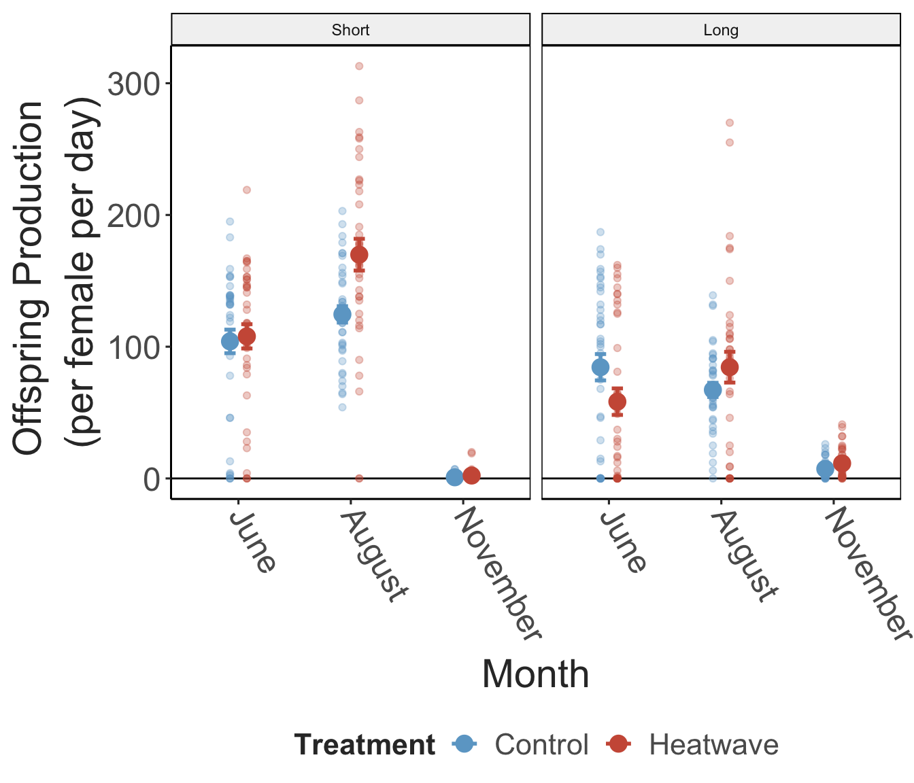
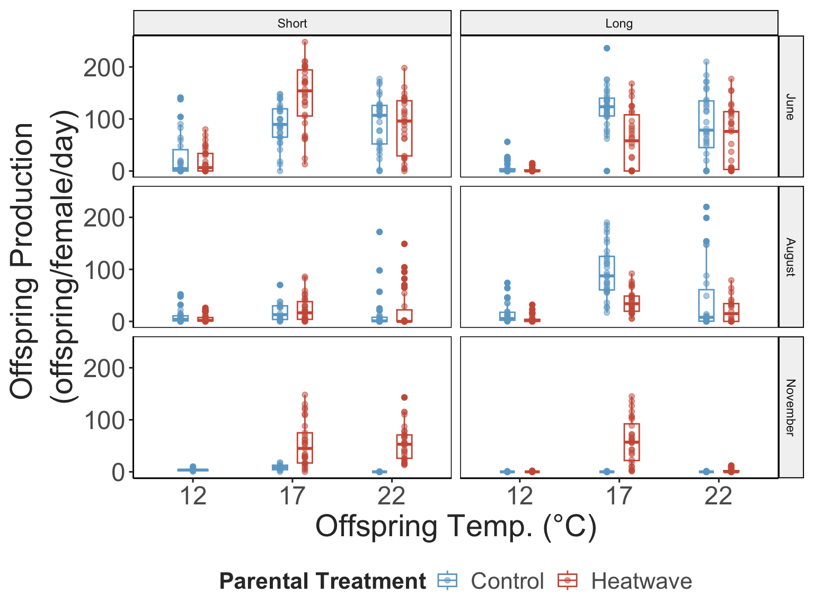
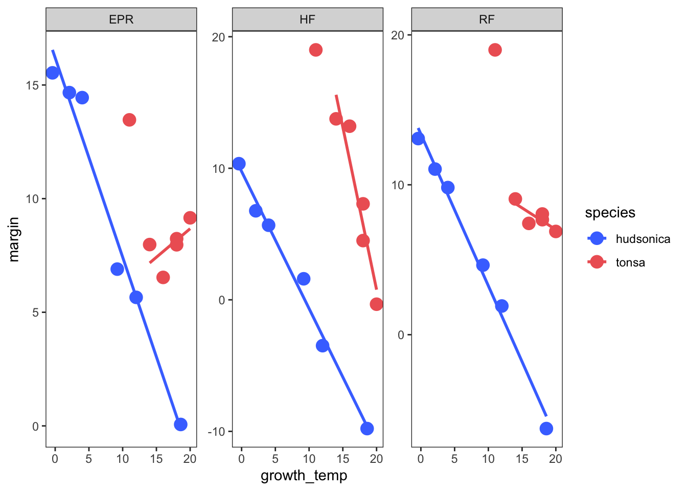
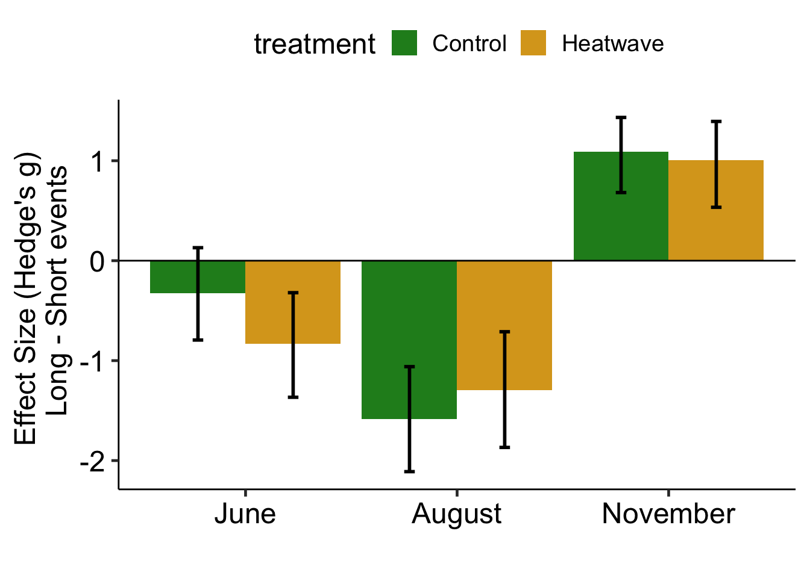

Figures for Seasonally variable thermal performance curves prevent
adverse effects of heatwaves
================

- [Main Text Figures](#main-text-figures)
- [Supplemental Information](#supplemental-information)

## Main Text Figures

``` r
comb_epr_plot = comb_preds %>% 
  filter(metric == "EPR") %>% 
  ggplot() +
  geom_point(aes(temp, rate, colour = curve_id), 
             filter(comb_d, metric == "EPR"), 
             size = 1.5, alpha = 0.6, 
             position = position_jitter(width = 0.5, height = 0)) +
  geom_ribbon(aes(temp, ymin = conf_lower, ymax = conf_upper, group = curve_id), 
              filter(comb_boot_conf_preds, metric == "EPR"), 
              fill = 'grey60', alpha = 0.3) +
  geom_line(aes(temp, .fitted, col = curve_id), linewidth = 2) +
  scale_colour_manual(values = comb_colors) + 
  labs(x = "", 
       y = "Egg Production \n(eggs/female/day)",
       colour = "Month") + 
  theme_matt(base_size = 12)

comb_hs_plot = comb_preds %>% 
  filter(metric == "HF") %>% 
  ggplot() +
  geom_point(aes(temp, rate, colour = curve_id), filter(comb_d, metric == "HF"), size = 1.5, alpha = 0.6, 
             position = position_jitter(width = 0.5, height = 0)) +
  geom_ribbon(aes(temp, ymin = conf_lower, ymax = conf_upper, group = curve_id), filter(comb_boot_conf_preds, metric == "HF"), fill = 'grey60', alpha = 0.3) +
  geom_line(aes(temp, .fitted, col = curve_id), linewidth = 2) +
  #scale_color_brewer(type = "div", palette = 5, direction = -1) + 
  #scale_color_viridis_d(option = "mako") + 
  scale_colour_manual(values = comb_colors) + 
  labs(x = "", 
       y = "Hatching Success \n(%)",
       colour = "Month") + 
  theme_matt(base_size = 12)

comb_rf_plot = comb_preds %>% 
  filter(metric == "RF") %>% 
  ggplot() +
  geom_point(aes(temp, rate, colour = curve_id), filter(comb_d, metric == "RF"), size = 1.5, alpha = 0.6, 
             position = position_jitter(width = 0.5, height = 0)) +
  geom_ribbon(aes(temp, ymin = conf_lower, ymax = conf_upper, group = curve_id), filter(comb_boot_conf_preds, metric == "RF"), fill = 'grey60', alpha = 0.3) +
  geom_line(aes(temp, .fitted, col = curve_id), linewidth = 2) +
  #scale_color_brewer(type = "div", palette = 5, direction = -1) + 
  #scale_color_viridis_d(option = "mako") + 
  scale_colour_manual(values = comb_colors) + 
  labs(x = "Temperature (°C)", 
       y = "Offspring Production \n(offspring/female/day)",
       colour = "Month") + 
  theme_matt(base_size = 12)

comb_tsc = ggplot(comb_surv, aes(x=Temp, y=Surv, colour=Month)) + 
  geom_point(size=1.5, position=position_jitter(width=0.1, height=0.03)) +
  xlab("Temperature (°C)")+
  ylab("Survivorship \n(proportion survived)")+
  labs(colour = "Month") + 
  geom_hline(yintercept = 0.5, linetype = "dashed") +
  geom_smooth(method = "glm", method.args = list(family = "binomial"), se=T, linewidth = 2) +
  scale_y_continuous(breaks = c(0,1)) + 
  #scale_color_brewer(type = "div", palette = 5, direction = -1) + 
  #scale_color_viridis_d(option = "mako") + 
  scale_colour_manual(values = comb_colors) + 
  theme_matt(base_size = 12)

ggarrange(comb_epr_plot, comb_hs_plot, comb_rf_plot, comb_tsc, 
          ncol = 2, nrow = 2,
          common.legend = T, legend = "bottom", 
          labels = "AUTO", vjust = 1)
```


``` r

# ggarrange(comb_epr_plot, comb_hs_plot, comb_rf_plot, comb_tsc, nrow = 1,
#           common.legend = T, legend = "bottom")
```

``` r
combined_opt_coll = comb_params %>% 
  filter(metric == "RF" & term == "topt") %>% 
  ggplot(aes(x = growth_temp, y = estimate, shape = species)) + 
  geom_smooth(data = filter(comb_params, metric == "RF" & term == "topt" & curve_id != "November_2"),
              method = "lm", colour = "grey50") + 
  geom_point(size = 3, stroke = 1) + 
  scale_shape_manual(values = c(16,21)) + 
  ylab("Optimum (°C)") + 
  xlab("Collection Temperature (°C)") + 
  labs(colour = "Month") + 
  theme_matt(base_size = 12)

combined_opt_diff = comb_params %>% 
  filter(metric == "RF" & term == "topt") %>% 
  ggplot(aes(x = growth_temp, y = margin, shape = species)) +
  geom_hline(yintercept = 0, linewidth =1, linetype = "dashed") +
  geom_smooth(data = filter(comb_params, metric == "RF" & term == "topt" & curve_id != "November_2"),
              method = "lm", colour = "grey50") + 
  geom_point(size = 3, stroke = 1) + 
  ylab("Margin (°C)") + 
  xlab("Collection Temperature (°C)") + 
  scale_shape_manual(values = c(16,21)) + 
  theme_matt(base_size = 12) 

combined_ld_coll = ggplot(combined_tolerance, aes(x = Coll_temp, y = LD50, shape = species)) + 
  geom_smooth(method = "lm", colour = "grey50") + 
  geom_point(size = 3, stroke = 1) + 
  scale_shape_manual(values = c(16,21)) + 
  ylab("Thermal Tolerance (°C)") + 
  xlab("Collection Temperature (°C)") + 
  theme_matt(base_size = 12)

combined_ld_diff = ggplot(combined_tolerance, aes(x = Coll_temp, y = margin, shape = species)) +
  geom_smooth(method = "lm", colour = "grey50") + 
  geom_point(size = 3, stroke = 1) + 
  scale_shape_manual(values = c(16,21)) + 
  ylab("Warming Tolerance (°C)") + 
  xlab("Collection Temperature (°C)") + 
  theme_matt(base_size = 12)

ggarrange(combined_opt_coll, combined_opt_diff, combined_ld_coll, combined_ld_diff, ncol = 2, nrow = 2, common.legend = T,
          legend = "bottom", labels = "AUTO")
```


``` r
F0_hatched.model = lme4::glmer(data = f0_model_data, family = poisson, 
                               Hatched ~ Treatment * Day + 
                                 (1|Month) + (1|female_ID))

summary(F0_hatched.model)
## Generalized linear mixed model fit by maximum likelihood (Laplace Approximation) ['glmerMod']
##  Family: poisson  ( log )
## Formula: Hatched ~ Treatment * Day + (1 | Month) + (1 | female_ID)
##    Data: f0_model_data
## 
##      AIC      BIC   logLik deviance df.resid 
##   8235.0   8259.5  -4111.5   8223.0      426 
## 
## Scaled residuals: 
##     Min      1Q  Median      3Q     Max 
## -8.9713 -2.0464 -0.4943  2.1551  7.5467 
## 
## Random effects:
##  Groups    Name        Variance Std.Dev.
##  female_ID (Intercept) 1.468    1.211   
##  Month     (Intercept) 2.239    1.496   
## Number of obs: 432, groups:  female_ID, 216; Month, 3
## 
## Fixed effects:
##                             Estimate Std. Error z value Pr(>|z|)    
## (Intercept)                  3.30143    0.87265   3.783 0.000155 ***
## TreatmentHeatwave            0.22773    0.16967   1.342 0.179539    
## Day5_to_7                   -0.37316    0.01665 -22.413  < 2e-16 ***
## TreatmentHeatwave:Day5_to_7 -0.22533    0.02352  -9.581  < 2e-16 ***
## ---
## Signif. codes:  0 '***' 0.001 '**' 0.01 '*' 0.05 '.' 0.1 ' ' 1
## 
## Correlation of Fixed Effects:
##             (Intr) TrtmnH Dy5__7
## TretmntHtwv -0.098              
## Day5_to_7   -0.008  0.040       
## TrtmH:D5__7  0.006 -0.053 -0.708
car::Anova(F0_hatched.model, type = "III")
## Analysis of Deviance Table (Type III Wald chisquare tests)
## 
## Response: Hatched
##                  Chisq Df Pr(>Chisq)    
## (Intercept)    14.3129  1  0.0001548 ***
## Treatment       1.8014  1  0.1795386    
## Day           502.3581  1  < 2.2e-16 ***
## Treatment:Day  91.7891  1  < 2.2e-16 ***
## ---
## Signif. codes:  0 '***' 0.001 '**' 0.01 '*' 0.05 '.' 0.1 ' ' 1
```

``` r
f0_model_females = F0_epr %>% 
  group_by(Month, Treatment, Female) %>% 
  count() %>% 
  filter(n == 2) %>% 
  mutate('female_ID' = paste(Month, Treatment, Female, sep = "_"))

f0_model_data = F0_epr %>% 
  mutate('female_ID' = paste(Month, Treatment, Female, sep = "_")) %>% 
  filter(female_ID %in% f0_model_females$female_ID)

f0_summary = f0_model_data %>% 
  group_by(Month, Treatment, Day) %>%  
  summarise("mean_hatched" = mean(Hatched, na.rm = T),
            "hatched_se" = st.err(Hatched, na.rm = T)) %>% 
  ungroup() %>% 
  mutate(Day = if_else(Day == "1_to_3", "Short", "Long"),
         Month = fct_relevel(Month, "June", "August", "November"),
         Day = fct_relevel(Day, "Short", "Long"))

ggplot(f0_summary, 
       aes(x = Month, y = mean_hatched, colour = Treatment)) + 
  facet_grid(.~Day, scales = "free_y") + 
  geom_hline(yintercept = 0) + 
  geom_errorbar(aes(ymin = mean_hatched - hatched_se, 
                    ymax = mean_hatched + hatched_se),
                width = 0.2, linewidth = 1,
                position = position_dodge(width = 0.3)) + 
  geom_point(size = 4, position = position_dodge(width = 0.3)) + 
  scale_colour_manual(values = c("Heatwave" = "coral3", "Control" = "skyblue3")) + 
  labs(x = "Month", 
       y = "Mean Offspring Production \n(offspring/female/day)") + 
  theme_matt() + 
  theme(panel.border = element_rect(fill = NA, colour = "black"),
        legend.position = "bottom",
        axis.text.x = element_text(angle = 300, hjust = 0, vjust = 0.5))
```



``` r
f1_model_data = F1_epr %>% 
  mutate(Offspring_temp = as.factor(Offspring_temp)) %>% 
  ungroup() %>% 
  mutate(Day = if_else(Day == "1_to_3", "Short", "Long"),
         Month = fct_relevel(Month, "June", "August", "November"),
         Day = fct_relevel(Day, "Short", "Long"))

ggplot(f1_model_data, 
       aes(x = Offspring_temp, y = Hatched, colour = Parental_treatment)) + 
  facet_grid(Month~Day) + 
  #geom_violin(position = position_dodge(width = 1)) + 
  geom_boxplot(position = position_dodge(width = 0.5),
               width = 0.3) + 
  geom_point(position = position_dodge(width = 0.5),
             alpha = 0.5) + 
  scale_colour_manual(values = c("Heatwave" = "coral3", "Control" = "skyblue3")) + 
  scale_y_continuous(breaks = c(0, 100, 200)) + 
  labs(x = "Offspring Temp. (°C)", 
       y = "Offspring Production \n(offspring/female/day)",
       colour = "Parental Treatment") + 
  theme_matt() + 
  theme(panel.border = element_rect(fill = NA, colour = "black"),
        legend.position = "bottom")
```



``` r
F1_hatched.model = lme4::glmer(data = f1_model_data, family = poisson, 
                               Hatched ~ Parental_treatment * Day * Offspring_temp + 
                                 (1 + Parental_treatment|Month))

summary(F1_hatched.model)
## Generalized linear mixed model fit by maximum likelihood (Laplace Approximation) ['glmerMod']
##  Family: poisson  ( log )
## Formula: Hatched ~ Parental_treatment * Day * Offspring_temp + (1 + Parental_treatment |  
##     Month)
##    Data: f1_model_data
## 
##      AIC      BIC   logLik deviance df.resid 
##  33587.5  33660.0 -16778.7  33557.5      916 
## 
## Scaled residuals: 
##     Min      1Q  Median      3Q     Max 
## -12.080  -3.935  -1.187   2.948  27.215 
## 
## Random effects:
##  Groups Name                       Variance Std.Dev. Corr 
##  Month  (Intercept)                3.321    1.822         
##         Parental_treatmentHeatwave 3.064    1.750    -0.96
## Number of obs: 931, groups:  Month, 3
## 
## Fixed effects:
##                                                     Estimate Std. Error z value Pr(>|z|)    
## (Intercept)                                          1.60247    1.04241   1.537    0.124    
## Parental_treatmentHeatwave                           0.71588    1.00227   0.714    0.475    
## DayLong                                             -0.61233    0.05000 -12.247   <2e-16 ***
## Offspring_temp17                                     1.14693    0.03469  33.063   <2e-16 ***
## Offspring_temp22                                     1.02875    0.03468  29.664   <2e-16 ***
## Parental_treatmentHeatwave:DayLong                  -0.80342    0.09293  -8.646   <2e-16 ***
## Parental_treatmentHeatwave:Offspring_temp17          0.71131    0.05197  13.687   <2e-16 ***
## Parental_treatmentHeatwave:Offspring_temp22          0.54682    0.05247  10.421   <2e-16 ***
## DayLong:Offspring_temp17                             1.21272    0.05456  22.229   <2e-16 ***
## DayLong:Offspring_temp22                             0.82261    0.05566  14.780   <2e-16 ***
## Parental_treatmentHeatwave:DayLong:Offspring_temp17 -0.15317    0.09738  -1.573    0.116    
## Parental_treatmentHeatwave:DayLong:Offspring_temp22 -0.05691    0.09930  -0.573    0.567    
## ---
## Signif. codes:  0 '***' 0.001 '**' 0.01 '*' 0.05 '.' 0.1 ' ' 1
## 
## Correlation of Fixed Effects:
##             (Intr) Prnt_H DayLng Off_17 Off_22 Pr_H:DL P_H:O_1 P_H:O_2 DL:O_1 DL:O_2
## Prntl_trtmH -0.961                                                                  
## DayLong     -0.017  0.017                                                           
## Offsprng_17 -0.024  0.025  0.507                                                    
## Offsprng_22 -0.024  0.025  0.507  0.731                                             
## Prntl_tH:DL  0.009 -0.024 -0.538 -0.273 -0.273                                      
## Prnt_H:O_17  0.016 -0.042 -0.338 -0.667 -0.488  0.458                               
## Prnt_H:O_22  0.016 -0.042 -0.335 -0.483 -0.661  0.454   0.816                       
## DyLng:Of_17  0.015 -0.015 -0.916 -0.636 -0.465  0.493   0.424   0.307               
## DyLng:Of_22  0.015 -0.016 -0.898 -0.455 -0.623  0.483   0.304   0.412   0.823       
## P_H:DL:O_17 -0.008  0.022  0.513  0.356  0.260 -0.954  -0.532  -0.433  -0.560 -0.461
## P_H:DL:O_22 -0.008  0.022  0.503  0.255  0.349 -0.936  -0.429  -0.526  -0.461 -0.560
##             P_H:DL:O_1
## Prntl_trtmH           
## DayLong               
## Offsprng_17           
## Offsprng_22           
## Prntl_tH:DL           
## Prnt_H:O_17           
## Prnt_H:O_22           
## DyLng:Of_17           
## DyLng:Of_22           
## P_H:DL:O_17           
## P_H:DL:O_22  0.893
coefficients(F1_hatched.model)
## $Month
##          (Intercept) Parental_treatmentHeatwave    DayLong Offspring_temp17 Offspring_temp22
## June       3.2357331                 -0.2739582 -0.6123292         1.146931         1.028746
## August     2.5110937                 -0.7530331 -0.6123292         1.146931         1.028746
## November  -0.9361519                  3.1716816 -0.6123292         1.146931         1.028746
##          Parental_treatmentHeatwave:DayLong Parental_treatmentHeatwave:Offspring_temp17
## June                             -0.8034179                                   0.7113092
## August                           -0.8034179                                   0.7113092
## November                         -0.8034179                                   0.7113092
##          Parental_treatmentHeatwave:Offspring_temp22 DayLong:Offspring_temp17
## June                                       0.5468181                 1.212715
## August                                     0.5468181                 1.212715
## November                                   0.5468181                 1.212715
##          DayLong:Offspring_temp22 Parental_treatmentHeatwave:DayLong:Offspring_temp17
## June                    0.8226093                                          -0.1531655
## August                  0.8226093                                          -0.1531655
## November                0.8226093                                          -0.1531655
##          Parental_treatmentHeatwave:DayLong:Offspring_temp22
## June                                             -0.05690774
## August                                           -0.05690774
## November                                         -0.05690774
## 
## attr(,"class")
## [1] "coef.mer"
car::Anova(F1_hatched.model, type = "III")
## Analysis of Deviance Table (Type III Wald chisquare tests)
## 
## Response: Hatched
##                                           Chisq Df Pr(>Chisq)    
## (Intercept)                              2.3632  1    0.12423    
## Parental_treatment                       0.5102  1    0.47507    
## Day                                    149.9922  1    < 2e-16 ***
## Offspring_temp                        1158.0413  2    < 2e-16 ***
## Parental_treatment:Day                  74.7488  1    < 2e-16 ***
## Parental_treatment:Offspring_temp      189.0279  2    < 2e-16 ***
## Day:Offspring_temp                     532.5149  2    < 2e-16 ***
## Parental_treatment:Day:Offspring_temp    5.8855  2    0.05272 .  
## ---
## Signif. codes:  0 '***' 0.001 '**' 0.01 '*' 0.05 '.' 0.1 ' ' 1
```

``` r
f1_size_data = F1_fbs %>% 
  ungroup() %>% 
  mutate(Day = if_else(Day == "1_to_3", "Short", "Long"),
         Month = fct_relevel(Month, "June", "August", "November"),
         Day = fct_relevel(Day, "Short", "Long"))

F1_size.model = lme4::lmer(data = f1_size_data, 
                           Size ~ Parental_treatment * Day * Offspring_temp + 
                             (1 + Parental_treatment|Month))

summary(F1_hatched.model)
## Generalized linear mixed model fit by maximum likelihood (Laplace Approximation) ['glmerMod']
##  Family: poisson  ( log )
## Formula: Hatched ~ Parental_treatment * Day * Offspring_temp + (1 + Parental_treatment |  
##     Month)
##    Data: f1_model_data
## 
##      AIC      BIC   logLik deviance df.resid 
##  33587.5  33660.0 -16778.7  33557.5      916 
## 
## Scaled residuals: 
##     Min      1Q  Median      3Q     Max 
## -12.080  -3.935  -1.187   2.948  27.215 
## 
## Random effects:
##  Groups Name                       Variance Std.Dev. Corr 
##  Month  (Intercept)                3.321    1.822         
##         Parental_treatmentHeatwave 3.064    1.750    -0.96
## Number of obs: 931, groups:  Month, 3
## 
## Fixed effects:
##                                                     Estimate Std. Error z value Pr(>|z|)    
## (Intercept)                                          1.60247    1.04241   1.537    0.124    
## Parental_treatmentHeatwave                           0.71588    1.00227   0.714    0.475    
## DayLong                                             -0.61233    0.05000 -12.247   <2e-16 ***
## Offspring_temp17                                     1.14693    0.03469  33.063   <2e-16 ***
## Offspring_temp22                                     1.02875    0.03468  29.664   <2e-16 ***
## Parental_treatmentHeatwave:DayLong                  -0.80342    0.09293  -8.646   <2e-16 ***
## Parental_treatmentHeatwave:Offspring_temp17          0.71131    0.05197  13.687   <2e-16 ***
## Parental_treatmentHeatwave:Offspring_temp22          0.54682    0.05247  10.421   <2e-16 ***
## DayLong:Offspring_temp17                             1.21272    0.05456  22.229   <2e-16 ***
## DayLong:Offspring_temp22                             0.82261    0.05566  14.780   <2e-16 ***
## Parental_treatmentHeatwave:DayLong:Offspring_temp17 -0.15317    0.09738  -1.573    0.116    
## Parental_treatmentHeatwave:DayLong:Offspring_temp22 -0.05691    0.09930  -0.573    0.567    
## ---
## Signif. codes:  0 '***' 0.001 '**' 0.01 '*' 0.05 '.' 0.1 ' ' 1
## 
## Correlation of Fixed Effects:
##             (Intr) Prnt_H DayLng Off_17 Off_22 Pr_H:DL P_H:O_1 P_H:O_2 DL:O_1 DL:O_2
## Prntl_trtmH -0.961                                                                  
## DayLong     -0.017  0.017                                                           
## Offsprng_17 -0.024  0.025  0.507                                                    
## Offsprng_22 -0.024  0.025  0.507  0.731                                             
## Prntl_tH:DL  0.009 -0.024 -0.538 -0.273 -0.273                                      
## Prnt_H:O_17  0.016 -0.042 -0.338 -0.667 -0.488  0.458                               
## Prnt_H:O_22  0.016 -0.042 -0.335 -0.483 -0.661  0.454   0.816                       
## DyLng:Of_17  0.015 -0.015 -0.916 -0.636 -0.465  0.493   0.424   0.307               
## DyLng:Of_22  0.015 -0.016 -0.898 -0.455 -0.623  0.483   0.304   0.412   0.823       
## P_H:DL:O_17 -0.008  0.022  0.513  0.356  0.260 -0.954  -0.532  -0.433  -0.560 -0.461
## P_H:DL:O_22 -0.008  0.022  0.503  0.255  0.349 -0.936  -0.429  -0.526  -0.461 -0.560
##             P_H:DL:O_1
## Prntl_trtmH           
## DayLong               
## Offsprng_17           
## Offsprng_22           
## Prntl_tH:DL           
## Prnt_H:O_17           
## Prnt_H:O_22           
## DyLng:Of_17           
## DyLng:Of_22           
## P_H:DL:O_17           
## P_H:DL:O_22  0.893
coefficients(F1_hatched.model)
## $Month
##          (Intercept) Parental_treatmentHeatwave    DayLong Offspring_temp17 Offspring_temp22
## June       3.2357331                 -0.2739582 -0.6123292         1.146931         1.028746
## August     2.5110937                 -0.7530331 -0.6123292         1.146931         1.028746
## November  -0.9361519                  3.1716816 -0.6123292         1.146931         1.028746
##          Parental_treatmentHeatwave:DayLong Parental_treatmentHeatwave:Offspring_temp17
## June                             -0.8034179                                   0.7113092
## August                           -0.8034179                                   0.7113092
## November                         -0.8034179                                   0.7113092
##          Parental_treatmentHeatwave:Offspring_temp22 DayLong:Offspring_temp17
## June                                       0.5468181                 1.212715
## August                                     0.5468181                 1.212715
## November                                   0.5468181                 1.212715
##          DayLong:Offspring_temp22 Parental_treatmentHeatwave:DayLong:Offspring_temp17
## June                    0.8226093                                          -0.1531655
## August                  0.8226093                                          -0.1531655
## November                0.8226093                                          -0.1531655
##          Parental_treatmentHeatwave:DayLong:Offspring_temp22
## June                                             -0.05690774
## August                                           -0.05690774
## November                                         -0.05690774
## 
## attr(,"class")
## [1] "coef.mer"
car::Anova(F1_hatched.model, type = "III")
## Analysis of Deviance Table (Type III Wald chisquare tests)
## 
## Response: Hatched
##                                           Chisq Df Pr(>Chisq)    
## (Intercept)                              2.3632  1    0.12423    
## Parental_treatment                       0.5102  1    0.47507    
## Day                                    149.9922  1    < 2e-16 ***
## Offspring_temp                        1158.0413  2    < 2e-16 ***
## Parental_treatment:Day                  74.7488  1    < 2e-16 ***
## Parental_treatment:Offspring_temp      189.0279  2    < 2e-16 ***
## Day:Offspring_temp                     532.5149  2    < 2e-16 ***
## Parental_treatment:Day:Offspring_temp    5.8855  2    0.05272 .  
## ---
## Signif. codes:  0 '***' 0.001 '**' 0.01 '*' 0.05 '.' 0.1 ' ' 1
```

``` r
day_cols = c("1_to_3" = "grey80", "5_to_7" = "grey30")

size_temp1 = ggplot(F1_fbs, aes(x = Offspring_temp, y = Size, colour = Parental_treatment)) + 
  facet_grid(Month~Day) + 
  geom_jitter(width = 0.5, size = 1.6, alpha = 0.4) +
  geom_smooth(method = "lm", size = 1.4, alpha = 0.2) + 
  labs(x = "Offspring Temperature (°C)",
       y = "Size (mm)") + 
  scale_x_continuous(breaks = c(12,17,22)) + 
  scale_colour_manual(values = c("Heatwave" = "coral3", "Control" = "skyblue3")) + 
  theme_bw(base_size = 15) + theme(legend.position = "bottom",
                                   panel.grid = element_blank())

f1_size.model = lm(data = F1_fbs, Size ~ Offspring_temp * Parental_treatment * Month * Day)

#car::Anova(f1_size.model, type = "III")
size_temp2 = emmeans::emtrends(f1_size.model, c("Month", "Day", "Parental_treatment"), var = "Offspring_temp") %>% 
  as.data.frame() %>% 
  ggplot(aes(x = Parental_treatment, y = Offspring_temp.trend, 
             colour = Day, group = Day)) + 
  facet_wrap(Month~.) + 
  geom_hline(yintercept = 0) + 
  geom_point(size = 3,
             position = position_dodge(width = 0.5)) + 
  geom_errorbar(aes(ymin = lower.CL, ymax = upper.CL),
                size = 1, width = 0.3,
                position = position_dodge(width = 0.5)) + 
  geom_line(linewidth = 1.5,
            position = position_dodge(width = 0.5)) + 
  scale_colour_manual(values = day_cols) + 
  labs(x = "Parental Treatment",  
       y = "Size Slope (mm / °C)") + 
  theme_matt(base_size = 15) + 
  theme(legend.position = "bottom",
        axis.text.x = element_text(angle = 360-45,
                                   hjust = 0, vjust = 0.5))

ggarrange(size_temp1, size_temp2, labels = "AUTO", common.legend = F, legend = "bottom")
```



``` r
# F0_rf_summary$month = factor(F0_rf_summary$month, levels = c("June", "August", "November"))
# F0_rf_summary$duration = factor(F0_rf_summary$duration, levels = c("short", "long"))
# F0_dur_summary$month = factor(F0_dur_summary$month, levels = c("June", "August", "November"))
# 
# param_list = list("colour" = "black",
#                   "width" = 0.2) 
# 
# RF_short_db = plot(F0_RF_short, 
#                    axes.title.fontsize = 10,
#                    tick.fontsize = 10,
#                    effsize.markersize = 3,
#                    swarmplot.params = param_list,
#                    rawplot.ylabel = "Production",
#                    theme = ggpubr::theme_pubr())
# 
# RF_long_db = plot(F0_RF_long, 
#                   axes.title.fontsize = 10,
#                   tick.fontsize = 10,
#                   effsize.markersize = 3,
#                   swarmplot.params = param_list,
#                   rawplot.ylabel = "Production",
#                   theme = ggpubr::theme_pubr())
# 
# b1 = ggplot() + theme_pubclean() + ggtitle("          Short Heat Waves")
# b2 = ggplot() + theme_pubclean() + ggtitle("          Long Heat Waves")
# F0_fecundity_plot = ggarrange(b1, RF_short_db, b2, RF_long_db, ncol = 1, nrow = 4, heights = c(0.1, 1, 0.1, 1))
```

``` r
# x.axis_labels = c("1" = "short", "2" = "long", "3" = "short", "4" = "long")
# 
# F0_grid = F0_rf_summary %>% 
#   mutate(month = fct_relevel(month, "June", "August", "November")) %>% 
#   ggplot(aes(x = duration, y = difference, colour = trait, shape = duration)) + 
#   facet_grid(. ~ month) + 
#   geom_hline(yintercept = 0, colour = "black", linewidth = 0.3) +
#   geom_errorbar(aes(ymin = bca_ci_low, ymax = bca_ci_high), width = 0, linewidth = 1.3) + 
#   geom_point(size = 5, fill = "white") + 
#   scale_colour_manual(values = c("body size" = "grey75", "production" = "black")) + 
#   scale_shape_manual(values = c("long" = 16, "short" = 21)) + 
#   scale_x_discrete(labels= x.axis_labels) +
#   ggtitle("Direct Effects (F0)") + 
#   xlab("") +
#   ylab("Effect Size\nHeatwave - Control") + 
#   ylim(-1,1.1) + 
#   theme_bw(base_size = 12) + 
#   theme(panel.grid = element_blank(),
#         axis.text = element_text(colour = "black"),
#         axis.text.x = element_text(angle = -45, hjust = 0, vjust = 0.5),
#         legend.position = "none")
# 
# F1_summary = bind_rows(F1_rf_effect_size, F1_bs_effect_size) %>% 
#   dplyr::select(variable, difference, 
#                 bca_ci_low, bca_ci_high, 
#                 month, duration, trait, generation, off_temp) %>% 
#   mutate("order_code" = paste(trait, duration, sep = "_"),
#          "order_number" = case_when(
#            order_code == "production_short" ~ 1,
#            order_code == "production_long" ~ 2,
#            order_code == "body size_short" ~ 3,
#            order_code == "body size_long" ~ 4),
#          month = fct_relevel(month, "June", "August", "November"))
# 
# F1_summary$order_number = factor(F1_summary$order_number, levels = c(1,2,3,4))
# F1_grid = ggplot(F1_summary, aes(x = order_number, y = difference, colour = trait, shape = duration, group = trait)) +
#   facet_grid(off_temp ~ month, ) + 
#   geom_hline(yintercept = 0, colour = "black", linewidth = 0.3) +
#   geom_line() + 
#   geom_errorbar(aes(ymin = bca_ci_low, ymax = bca_ci_high), width = 0, linewidth = 1) + 
#   geom_point(size = 3, fill = "white") + 
#   scale_colour_manual(values = c("body size" = "grey75", "production" = "black")) + 
#   scale_shape_manual(values = c("long" = 16, "short" = 21)) + 
#   xlim(0.5,4.5) + 
#   scale_x_discrete(labels= x.axis_labels) +
#   xlab("") +
#   ylab("Effect Size\nHeatwave - Control") + 
#   ggtitle("Transgenerational Effects (F1)") + 
#   theme_bw(base_size = 12) + 
#   theme(panel.grid = element_blank(),
#         strip.background.x = element_blank(),
#         strip.text.x = element_blank(),
#         axis.text = element_text(colour = "black"),
#         axis.text.x = element_text(angle = -45, hjust = 0, vjust = 0.5))
# 
# ggarrange(F0_grid, F1_grid, nrow = 2, ncol = 1, heights = c(0.45,1), common.legend = T, legend = "right")
```

## Supplemental Information

``` r
#field tpc parameters
comb_params %>%  
  mutate(curve_id = fct_relevel(curve_id, c("January", "February", "March", "April", "May", "June", 
                                            "July", "August", "September", "October", "November_1", "November_2"))) %>% 
  ggplot(aes(x = curve_id, y = estimate, colour = species)) +
  facet_wrap(term~metric, scales = 'free_y') + 
  geom_point(size = 4) +
  geom_linerange(aes(ymin = conf_lower, ymax = conf_upper)) +
  scale_colour_manual(values = c("royalblue1", "indianred2")) + 
  labs(x = "Month",
       y = "Parameter Estimate",
       colour = "Species") + 
  theme_bw(base_size = 16) +
  theme(panel.grid = element_blank(),
        axis.text.x = element_text(angle = 315, hjust = 0, vjust = 0.5))
```


``` r
#field tpc parameters
ggplot(comb_params, aes(x = growth_temp, y = estimate, colour = species)) +
  facet_wrap(term~metric, scales = 'free_y') + 
  geom_smooth(data = filter(comb_params, curve_id != "November_2"),
              method = "lm", se = F) + 
  geom_point(size = 4) +
  geom_linerange(aes(ymin = conf_lower, ymax = conf_upper)) +
  scale_colour_manual(values = c("royalblue1", "indianred2")) + 
  labs(x = "Collection Temperature (°C)",
       y = "Parameter Estimate",
       colour = "Species") + 
  theme_bw(base_size = 12) +
  theme(panel.grid = element_blank())
```


``` r
comb_params %>% 
  filter(term == "topt") %>% 
  ggplot(aes(x = growth_temp, y = margin, colour = species, group = species)) + 
  facet_grid(metric~., scales = 'free_y') + 
  geom_hline(yintercept = 0) +
  geom_smooth(data = filter(comb_params, term == "topt" & curve_id != "November_2"),
              method = "lm", se = F, linewidth = 1, colour = "black") + 
  geom_point(size = 4) +
  scale_colour_manual(values = c("royalblue1", "indianred2")) + 
  labs(x = "Collection Temperature",
       y = "Safety Margin") + 
  theme_bw(base_size = 18) +
  theme(panel.grid = element_blank())
```


``` r
ggplot(f0_model_data, 
       aes(x = Day, y = Hatched, colour = Month, group = female_ID)) + 
  facet_grid(Month~Treatment, scales = "free_y") + 
  geom_line() + 
  theme_matt() + 
  theme(panel.border = element_rect(fill = NA, colour = "black"))
```



``` r
# #Subsequent Rows
# F1_hs_effect_size$trait = "success"
# F1_hs_effect_size$generation = "F1"
# 
# F1_total_effect_size$trait = "epr"
# F1_total_effect_size$generation = "F1"
# 
# F1_rf_effect_size$trait = "production"
# F1_rf_effect_size$generation = "F1"
# 
# F1_bs_effect_size$trait = "body size"
# F1_bs_effect_size$generation = "F1"
# 
# F0_data = bind_rows(F0_hs_summary, F0_total_summary,F0_rf_summary, F0_size_summary) %>% 
#   dplyr::select(trait, difference, bca_ci_low, bca_ci_high, month, duration, trait, generation) %>% 
#   mutate("order_code" = paste(trait, duration, sep = "_"),
#          "order_number" = case_when(
#            order_code == "total_short" ~ 1,
#            order_code == "total_long" ~ 2,
#            order_code == "success_short" ~ 3,
#            order_code == "success_long" ~ 4,
#            order_code == "production_short" ~ 5,
#            order_code == "production_long" ~ 6,
#            order_code == "size_long" ~ 7),
#          month = fct_relevel(month, "June", "August", "November"),
#          trait = fct_relevel(trait, "total", "success", "production", "size"),
#          duration = fct_relevel(duration, "short", "long"),
#          group_ID = paste(month, trait, sep = "_"))
# 
# F0_data$order_number = factor(F0_data$order_number, levels = c(1,2,3,4,5,6,7))
# 
# 
# F1_data = bind_rows(F1_total_effect_size, F1_hs_effect_size, F1_rf_effect_size, F1_bs_effect_size) %>% 
#   dplyr::select(trait, difference, bca_ci_low, bca_ci_high, month, duration, generation, off_temp) %>% 
#   mutate("order_code" = paste(trait, duration, sep = "_"),
#          "order_number" = case_when(
#            order_code == "epr_short" ~ 1,
#            order_code == "epr_long" ~ 2,
#            order_code == "success_short" ~ 3,
#            order_code == "success_long" ~ 4,
#            order_code == "production_short" ~ 5,
#            order_code == "production_long" ~ 6,
#            order_code == "body size_short" ~ 7,
#            order_code == "body size_long" ~ 8),
#          trait = if_else(trait == "epr", "total", trait),
#          month = fct_relevel(month, "June", "August", "November"),
#          trait = fct_relevel(trait, "total", "success", "production", "size"),
#          duration = fct_relevel(duration, "short", "long"))
# 
# 
# F1_data$order_number = factor(F1_data$order_number, levels = c(1,2,3,4,5,6,7,8))
# 
# #Top row - F0 (direct effects)
# x.axis_labels = c("1" = "short", "2" = "long", "3" = "short", "4" = "long", 
#                   "5" = "short", "6" = "long", "7" = "short", "8" = "long")
# 
# F0_grid = ggplot(F0_data, aes(x = duration, y = difference, colour = trait, group = group_ID)) + 
#   facet_grid(. ~ month) + 
#   geom_line(position = position_dodge(width = 0.7),
#             linewidth = 1) + 
#   geom_hline(yintercept = 0, colour = "black", linewidth = 0.3) +
#   geom_errorbar(aes(ymin = bca_ci_low, ymax = bca_ci_high), width = 0, linewidth = 1, 
#                 position = position_dodge(width = 0.7)) + 
#   geom_point(size = 4, fill = "white", position = position_dodge(width = 0.7)) + 
#   scale_shape_manual(values = c("long" = 16, "short" = 21)) + 
#   scale_x_discrete(labels= x.axis_labels) +
#   scale_colour_manual(values = c("size" = "darkgrey",
#                                  "success" = "gold",
#                                  "production" = "forestgreen",
#                                  "total" = "cornflowerblue")) +  
#   xlab("") +
#   ylab("Effect Size\nHeatwave - Control") + 
#   theme_bw(base_size = 12) + 
#   theme(panel.grid = element_blank(),
#         axis.text = element_text(colour = "black"),
#         axis.text.x = element_text(angle = -45, hjust = 0, vjust = 0.5),
#         legend.position = "none")
# 
# #Following three rows - F1 (transgeneration / indirect effects)
# F1_grid = ggplot(F1_data, aes(x = duration, y = difference, colour = trait, group = trait)) + 
#   facet_grid(off_temp ~ month, ) + 
#   geom_hline(yintercept = 0, colour = "black", linewidth = 0.3) +
#   geom_line(position = position_dodge(width = 0.5),
#             linewidth = 1) + 
#   geom_errorbar(aes(ymin = bca_ci_low, ymax = bca_ci_high), width = 0, linewidth = 1,
#                 position = position_dodge(width = 0.5)) + 
#   geom_point(size = 3, fill = "white", position = position_dodge(width = 0.5)) + 
#   scale_shape_manual(values = c("long" = 16, "short" = 21)) + 
#   xlim(0.5,4.5) + 
#   scale_x_discrete(labels= x.axis_labels) +
#   scale_colour_manual(values = c("size" = "darkgrey",
#                                  "success" = "gold",
#                                  "production" = "forestgreen",
#                                  "total" = "cornflowerblue")) + 
#   xlab("") +
#   ylab("Effect Size \nHeatwave - Control") + 
#   theme_bw(base_size = 12) + 
#   theme(panel.grid = element_blank(),
#         strip.background.x = element_blank(),
#         strip.text.x = element_blank(),
#         axis.text = element_text(colour = "black"),
#         axis.text.x = element_text(angle = -45, hjust = 0, vjust = 0.5))
# 
# ggarrange(F0_grid, F1_grid, nrow = 2, ncol = 1, heights = c(0.35,1), common.legend = T, legend = "right", labels = "AUTO")
```

``` r
# effect_corr = F1_summary %>% 
#   select(trait, difference, month, duration, off_temp) %>%  
#   pivot_wider(id_cols = c(month, duration, off_temp),
#               names_from = trait, 
#               values_from = difference)
# 
# ggplot(effect_corr, aes(x = `body size`, y = production)) + 
#   geom_hline(yintercept = 0) + 
#   geom_vline(xintercept = 0) + 
#   geom_point(size = 3) + 
#   geom_smooth(method = "lm", se = F,
#               colour = "grey60",
#               size = 1) + 
#   labs(x = "Body Size Effect",
#        y = "Production Effect") + 
#   theme_matt()
```

``` r
#Effect of heatwave duration WITHIN treatment

### RECREATE USING EMMEANS

F0_dur_summary %>% 
  mutate(month = fct_relevel(month, c("June", "August", "November"))) %>% 
  ggplot(aes(x = month, fill = treatment, y = difference)) + 
  geom_bar(stat = "identity", position = position_dodge(width = 0.9), colour = "black", size = 1) + 
  geom_errorbar(aes(ymin = bca_ci_low, ymax = bca_ci_high),
                width = 0.1, size = 1,
                position = position_dodge(width = 0.9)) + 
  geom_hline(yintercept = 0) + 
  scale_fill_manual(values = c("grey30", "white")) + 
  labs(x = "",
       y = "Effect Size (Hedge's g) \n Long - Short events") + 
  theme_pubr(base_size = 18)
```


``` r
# How does heat wave duration affect transgenerational effects? Reaction norms shown below for effect size comparisons (heatwave - control) for different duration of parental exposure
# F1_data %>% 
#   dplyr::select(month, duration, off_temp, trait, difference, bca_ci_low, bca_ci_high) %>% 
#   mutate("ID" = paste(month, off_temp, trait, sep = "_"),
#          month = fct_relevel(month, c("June", "August", "November")),
#          duration = fct_relevel(duration, c("short", "long"))) %>% 
#   ggplot(aes(x = duration, y = difference, colour = month, group = ID)) + 
#   facet_wrap(trait~.) + 
#   geom_hline(yintercept = 0) + 
#   geom_line(size = 1, position = position_dodge(width = 0.1)) + 
#   geom_point(size = 2, position = position_dodge(width = 0.1)) + 
#   geom_errorbar(aes(ymin = bca_ci_low, ymax = bca_ci_high),
#                 size = 0.75, width = 0.1,
#                 position = position_dodge(width = 0.1)) + 
#   labs(x = "Parental Exposure Duration", 
#        y = "Effect Size (Hedge's g) \n Heatwave - Control") + 
#   ylim(-5,5) + 
#   theme_pubr(base_size = 18)
```

``` r
# #Pulls out reaction norms where there's a sign change (changes from positive, neutral, or negative between duration groups) 
# 
# duration_effects = F1_data %>% 
#   dplyr::select(month, duration, off_temp, trait, difference, bca_ci_low, bca_ci_high) %>% 
#   mutate("ID" = paste(month, off_temp, trait, sep = "_"),
#          month = fct_relevel(month, c("June", "August", "November")),
#          duration = fct_relevel(duration, c("short", "long"))) %>% 
#   group_by(ID, trait, duration) %>%  
#   mutate("zero_diff" = case_when(
#     sign(bca_ci_low) == sign(bca_ci_high) ~ "does not overlap zero",
#     sign(bca_ci_low) != sign(bca_ci_high) ~ "overlaps zero"
#   )) %>% 
#   ungroup(duration) %>% 
#   mutate("change" = case_when(
#     sign(difference)[1] == sign(difference)[2] & zero_diff[1] == zero_diff[2] ~ "Same",
#     sign(difference)[1] != sign(difference)[2] & zero_diff[1] == "overlaps zero" & zero_diff[2] == "overlaps zero" ~ "Same",
#     sign(difference)[1] != sign(difference)[2] & zero_diff[1] == zero_diff[2] & zero_diff[1] == "does not overlap zero" ~ "Different",
#     sign(difference)[1] != sign(difference)[2] & zero_diff[1] != zero_diff[2] ~ "Different",
#     sign(difference)[1] == sign(difference)[2] & zero_diff[1] != zero_diff[2] ~ "Different"
#   )) %>% 
#   arrange(month, off_temp, trait) %>% 
#   filter(change == "Different")
# 
# select_rnorms = duration_effects %>% 
#   dplyr::select(-duration, -difference, -bca_ci_low, -bca_ci_high, -ID, -zero_diff) %>% 
#   distinct()
# 
# sig_changes = F1_data %>% 
#   dplyr::select(month, duration, off_temp, trait, difference, bca_ci_low, bca_ci_high) %>% 
#   mutate("ID" = paste(month, off_temp, trait, sep = "_"),
#          month = fct_relevel(month, c("June", "August", "November")),
#          duration = fct_relevel(duration, c("short", "long"))) %>% 
#   filter(ID %in% select_rnorms$ID)
# 
# ggplot(sig_changes, aes(x = duration, y = difference, colour = month, group = ID)) + 
#   facet_wrap(trait~.) + 
#   geom_hline(yintercept = 0) + 
#   geom_line(size = 1, position = position_dodge(width = 0.1)) + 
#   geom_point(size = 2, position = position_dodge(width = 0.1)) + 
#   geom_errorbar(aes(ymin = bca_ci_low, ymax = bca_ci_high),
#                 size = 0.75, width = 0.1,
#                 position = position_dodge(width = 0.1)) + 
#   geom_label_repel(data = sig_changes %>% filter(duration == "long"), 
#                    aes(label = off_temp, 
#                        x = duration,
#                        y = difference, 
#                        color = month),
#                    box.padding = 0.5,
#                    nudge_x = 0.2,
#                    size = 7,
#                    show.legend=FALSE) + 
#   labs(x = "Parental Exposure Duration", 
#        y = "Effect Size (Hedge's g)\nHeatwave - Control") + 
#   ylim(-5,5) + 
#   theme_pubr(base_size = 18)
```

``` r
seasonal_cols = c("June" = "#E69F00", "August" = "#D55E00", "November" = "#0072B2")
F1_fbs$ID = paste(F1_fbs$Month, F1_fbs$Parental_treatment, F1_fbs$Day, sep = "_")
F1_fbs$Month = fct_relevel(F1_fbs$Month, "June", "August", "November")
```
