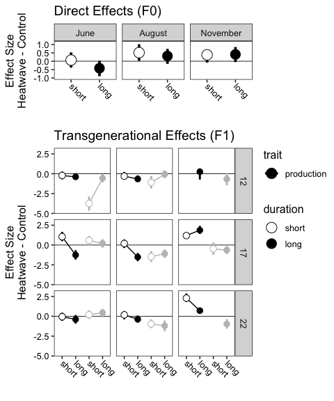
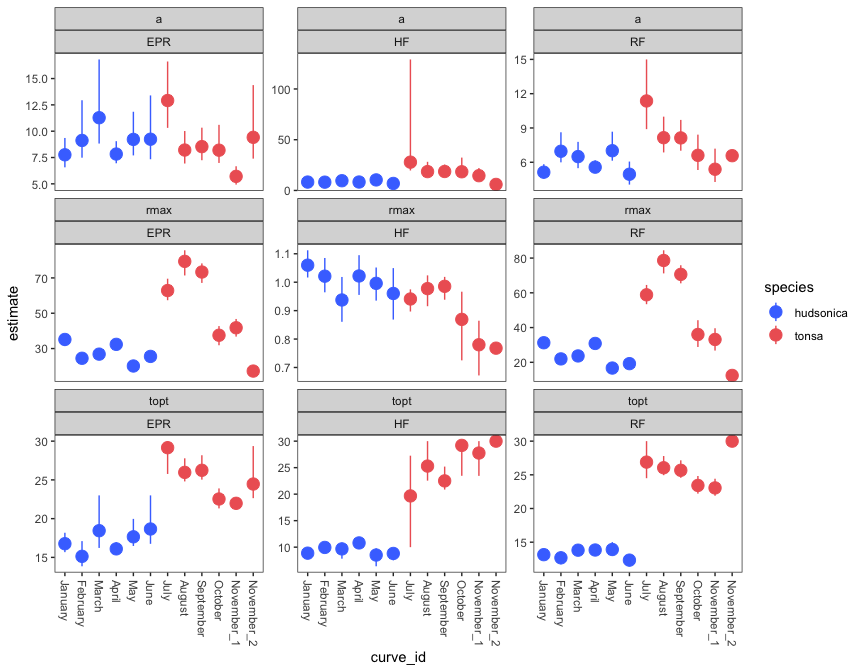
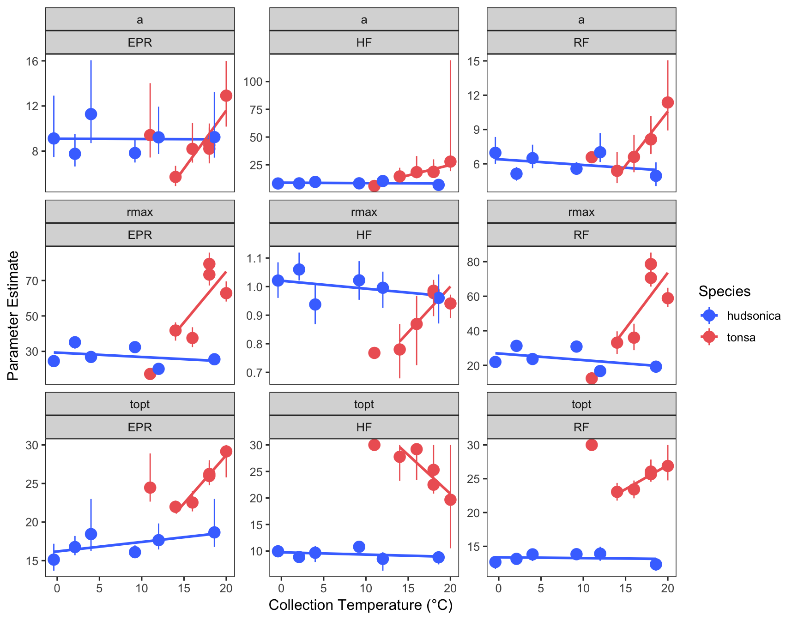
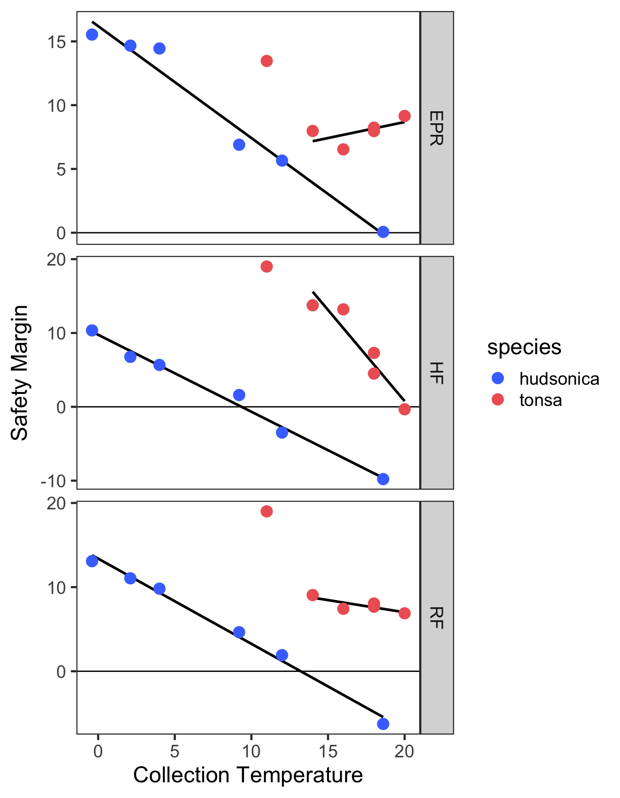
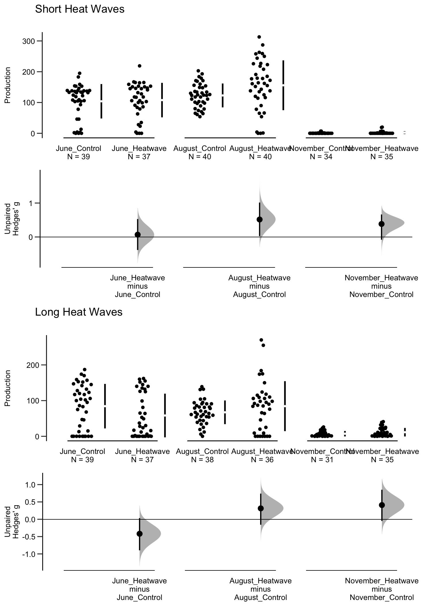
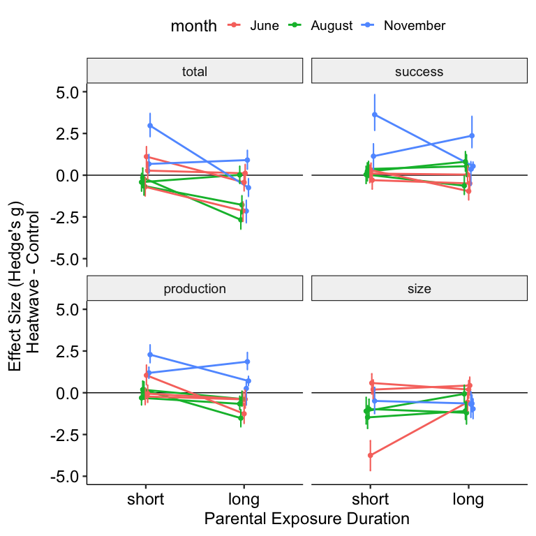
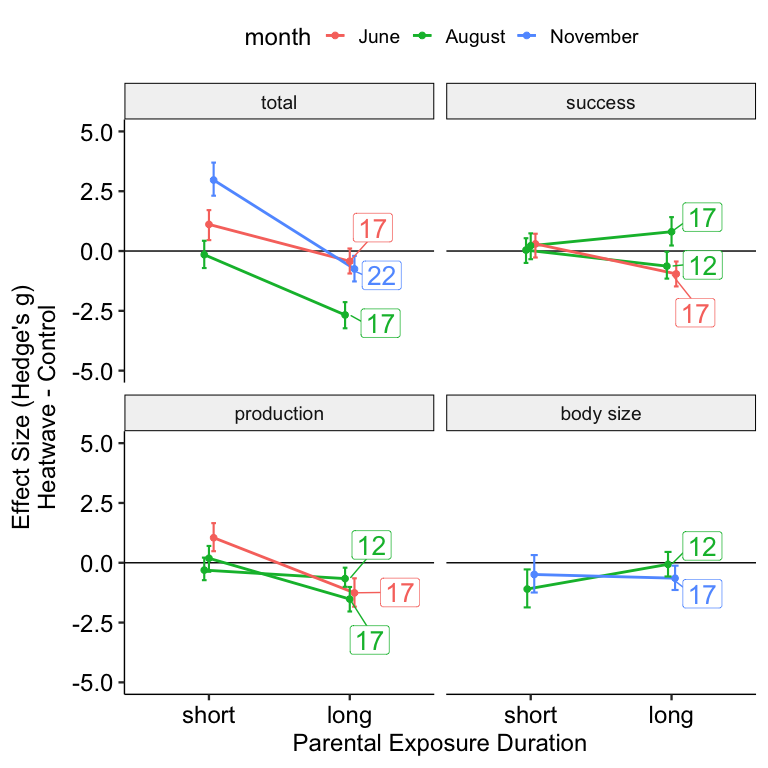

Figures for Seasonally variable thermal performance curves prevent
adverse effects of heatwaves
================

- <a href="#main-text-figures" id="toc-main-text-figures">Main Text
  Figures</a>
- <a href="#supplemental-information"
  id="toc-supplemental-information">Supplemental Information</a>

## Main Text Figures

``` r
comb_epr_plot = comb_preds %>% 
  filter(metric == "EPR") %>% 
  ggplot() +
  geom_point(aes(temp, rate, colour = curve_id), filter(comb_d, metric == "EPR"), size = 1.5, alpha = 0.6, 
             position = position_jitter(width = 0.5, height = 0)) +
  geom_ribbon(aes(temp, ymin = conf_lower, ymax = conf_upper, group = curve_id), filter(comb_boot_conf_preds, metric == "EPR"), fill = 'grey60', alpha = 0.3) +
  geom_line(aes(temp, .fitted, col = curve_id), linewidth = 2) +
  #scale_color_brewer(type = "div", palette = 5, direction = -1) + 
  #scale_color_viridis_d(option = "mako") + 
  scale_colour_manual(values = comb_colors) + 
  labs(x = "Temperature (degrees C)", 
       y = "Egg Production Rate \n(eggs/female/day)",
       colour = "Month") + 
  theme_matt(base_size = 12)

comb_hs_plot = comb_preds %>% 
  filter(metric == "HF") %>% 
  ggplot() +
  geom_point(aes(temp, rate, colour = curve_id), filter(comb_d, metric == "HF"), size = 1.5, alpha = 0.6, 
             position = position_jitter(width = 0.5, height = 0)) +
  geom_ribbon(aes(temp, ymin = conf_lower, ymax = conf_upper, group = curve_id), filter(comb_boot_conf_preds, metric == "HF"), fill = 'grey60', alpha = 0.3) +
  geom_line(aes(temp, .fitted, col = curve_id), size = 2) +
  #scale_color_brewer(type = "div", palette = 5, direction = -1) + 
  #scale_color_viridis_d(option = "mako") + 
  scale_colour_manual(values = comb_colors) + 
  labs(x = "Temperature (degrees C)", 
       y = "Hatching Success \n(%)",
       colour = "Month") + 
  theme_matt(base_size = 12)

comb_rf_plot = comb_preds %>% 
  filter(metric == "RF") %>% 
  ggplot() +
  geom_point(aes(temp, rate, colour = curve_id), filter(comb_d, metric == "RF"), size = 1.5, alpha = 0.6, 
             position = position_jitter(width = 0.5, height = 0)) +
  geom_ribbon(aes(temp, ymin = conf_lower, ymax = conf_upper, group = curve_id), filter(comb_boot_conf_preds, metric == "RF"), fill = 'grey60', alpha = 0.3) +
  geom_line(aes(temp, .fitted, col = curve_id), size = 2) +
  #scale_color_brewer(type = "div", palette = 5, direction = -1) + 
  #scale_color_viridis_d(option = "mako") + 
  scale_colour_manual(values = comb_colors) + 
  labs(x = "Temperature (degrees C)", 
       y = "Production \n(offspring/female/day)",
       colour = "Month") + 
  theme_matt(base_size = 12)

comb_tsc = ggplot(comb_surv, aes(x=Temp, y=Surv, colour=Month)) + 
  geom_point(size=1.5, position=position_jitter(width=0.1, height=0.03)) +
  xlab("Stress Temperature")+
  ylab("Survivorship \n(proportion survived)")+
  labs(colour = "Month") + 
  geom_hline(yintercept = 0.5, linetype = "dashed") +
  geom_smooth(method = "glm", method.args = list(family = "binomial"), se=T, size = 2) +
  scale_y_continuous(breaks = c(0,1)) + 
  #scale_color_brewer(type = "div", palette = 5, direction = -1) + 
  #scale_color_viridis_d(option = "mako") + 
  scale_colour_manual(values = comb_colors) + 
  theme_matt(base_size = 12)

ggarrange(comb_epr_plot, comb_hs_plot, comb_rf_plot, comb_tsc, 
          ncol = 2, nrow = 2,
          common.legend = T, legend = "bottom", labels = "AUTO")
```


``` r
combined_opt_coll = comb_params %>% 
  filter(metric == "RF" & term == "topt") %>% 
  ggplot(aes(x = growth_temp, y = estimate, shape = species)) + 
  geom_smooth(data = filter(comb_params, metric == "RF" & term == "topt" & curve_id != "November_2"),
              method = "lm", colour = "grey50") + 
  geom_point(size = 3, stroke = 1) + 
  scale_shape_manual(values = c(16,21)) + 
  ylab("Optimum (degrees C)") + 
  xlab("Collection Temperature (degrees c)") + 
  labs(colour = "Month") + 
  theme_matt(base_size = 12)

combined_opt_diff = comb_params %>% 
  filter(metric == "RF" & term == "topt") %>% 
  ggplot(aes(x = growth_temp, y = margin, shape = species)) +
  geom_hline(yintercept = 0, size =1, linetype = "dashed") +
  geom_smooth(data = filter(comb_params, metric == "RF" & term == "topt" & curve_id != "November_2"),
              method = "lm", colour = "grey50") + 
  geom_point(size = 3, stroke = 1) + 
  ylab("Margin (degrees C)") + 
  xlab("Collection Temperature (degrees c)") + 
  scale_shape_manual(values = c(16,21)) + 
  theme_matt(base_size = 12) 

combined_ld_coll = ggplot(combined_tolerance, aes(x = Coll_temp, y = LD50, shape = species)) + 
  geom_smooth(method = "lm", colour = "grey50") + 
  geom_point(size = 3, stroke = 1) + 
  scale_shape_manual(values = c(16,21)) + 
  ylab("Thermal Tolerance (degrees C)") + 
  xlab("Collection Temperature (degrees c)") + 
  theme_matt(base_size = 12)

combined_ld_diff = ggplot(combined_tolerance, aes(x = Coll_temp, y = margin, shape = species)) +
  geom_smooth(method = "lm", colour = "grey50") + 
  geom_point(size = 3, stroke = 1) + 
  scale_shape_manual(values = c(16,21)) + 
  ylab("Warming Tolerance (degrees C)") + 
  xlab("Collection Temperature (degrees c)") + 
  theme_matt(base_size = 12)

ggarrange(combined_opt_coll, combined_opt_diff, combined_ld_coll, combined_ld_diff, ncol = 2, nrow = 2, common.legend = T,
          legend = "bottom", labels = "AUTO")
```


``` r
F0_rf_summary$month = factor(F0_rf_summary$month, levels = c("June", "August", "November"))
F0_rf_summary$duration = factor(F0_rf_summary$duration, levels = c("short", "long"))
F0_dur_summary$month = factor(F0_dur_summary$month, levels = c("June", "August", "November"))

param_list = list("colour" = "black",
                  "width" = 0.2) 

RF_short_db = plot(F0_RF_short, 
                   axes.title.fontsize = 10,
                   tick.fontsize = 10,
                   effsize.markersize = 3,
                   swarmplot.params = param_list,
                   rawplot.ylabel = "Production",
                   theme = ggpubr::theme_pubr())

RF_long_db = plot(F0_RF_long, 
                  axes.title.fontsize = 10,
                  tick.fontsize = 10,
                  effsize.markersize = 3,
                  swarmplot.params = param_list,
                  rawplot.ylabel = "Production",
                  theme = ggpubr::theme_pubr())

b1 = ggplot() + theme_pubclean() + ggtitle("          Short Heat Waves")
b2 = ggplot() + theme_pubclean() + ggtitle("          Long Heat Waves")
F0_fecundity_plot = ggarrange(b1, RF_short_db, b2, RF_long_db, ncol = 1, nrow = 4, heights = c(0.1, 1, 0.1, 1))
```

``` r
x.axis_labels = c("1" = "short", "2" = "long", "3" = "short", "4" = "long")

F0_grid = F0_rf_summary %>% 
  mutate(month = fct_relevel(month, "June", "August", "November")) %>% 
  ggplot(aes(x = duration, y = difference, colour = trait, shape = duration)) + 
  facet_grid(. ~ month) + 
  geom_hline(yintercept = 0, colour = "black", size = 0.3) +
  geom_errorbar(aes(ymin = bca_ci_low, ymax = bca_ci_high), width = 0, size = 1.3) + 
  geom_point(size = 5, fill = "white") + 
  scale_colour_manual(values = c("body size" = "grey75", "production" = "black")) + 
  scale_shape_manual(values = c("long" = 16, "short" = 21)) + 
  scale_x_discrete(labels= x.axis_labels) +
  ggtitle("Direct Effects (F0)") + 
  xlab("") +
  ylab("Effect Size\nHeatwave - Control") + 
  ylim(-1,1.1) + 
  theme_bw(base_size = 12) + 
  theme(panel.grid = element_blank(),
        axis.text = element_text(colour = "black"),
        axis.text.x = element_text(angle = -45, hjust = 0, vjust = 0.5),
        legend.position = "none")

F1_summary = bind_rows(F1_rf_effect_size, F1_bs_effect_size) %>% 
  dplyr::select(variable, difference, 
                bca_ci_low, bca_ci_high, 
                month, duration, trait, generation, off_temp) %>% 
  mutate("order_code" = paste(trait, duration, sep = "_"),
         "order_number" = case_when(
           order_code == "production_short" ~ 1,
           order_code == "production_long" ~ 2,
           order_code == "body size_short" ~ 3,
           order_code == "body size_long" ~ 4),
         month = fct_relevel(month, "June", "August", "November"))

F1_summary$order_number = factor(F1_summary$order_number, levels = c(1,2,3,4))
F1_grid = ggplot(F1_summary, aes(x = order_number, y = difference, colour = trait, shape = duration, group = trait)) +
  facet_grid(off_temp ~ month, ) + 
  geom_hline(yintercept = 0, colour = "black", size = 0.3) +
  geom_line() + 
  geom_errorbar(aes(ymin = bca_ci_low, ymax = bca_ci_high), width = 0, size = 1) + 
  geom_point(size = 3, fill = "white") + 
  scale_colour_manual(values = c("body size" = "grey75", "production" = "black")) + 
  scale_shape_manual(values = c("long" = 16, "short" = 21)) + 
  xlim(0.5,4.5) + 
  scale_x_discrete(labels= x.axis_labels) +
  xlab("") +
  ylab("Effect Size\nHeatwave - Control") + 
  ggtitle("Transgenerational Effects (F1)") + 
  theme_bw(base_size = 12) + 
  theme(panel.grid = element_blank(),
        strip.background.x = element_blank(),
        strip.text.x = element_blank(),
        axis.text = element_text(colour = "black"),
        axis.text.x = element_text(angle = -45, hjust = 0, vjust = 0.5))

ggarrange(F0_grid, F1_grid, nrow = 2, ncol = 1, heights = c(0.45,1), common.legend = T, legend = "right")
```



## Supplemental Information

``` r
#field tpc parameters
comb_params %>%  
  mutate(curve_id = fct_relevel(curve_id, c("January", "February", "March", "April", "May", "June", 
                                            "July", "August", "September", "October", "November_1", "November_2"))) %>% 
  ggplot(aes(x = curve_id, y = estimate, colour = species)) +
  facet_wrap(term~metric, scales = 'free_y') + 
  geom_point(size = 4) +
  geom_linerange(aes(ymin = conf_lower, ymax = conf_upper)) +
  scale_colour_manual(values = c("royalblue1", "indianred2")) + 
  labs(x = "Month",
       y = "Parameter Estimate",
       colour = "Species") + 
  theme_bw(base_size = 16) +
  theme(panel.grid = element_blank(),
        axis.text.x = element_text(angle = 315, hjust = 0, vjust = 0.5))
```



``` r
#field tpc parameters
ggplot(comb_params, aes(x = growth_temp, y = estimate, colour = species)) +
  facet_wrap(term~metric, scales = 'free_y') + 
  geom_smooth(data = filter(comb_params, curve_id != "November_2"),
              method = "lm", se = F) + 
  geom_point(size = 4) +
  geom_linerange(aes(ymin = conf_lower, ymax = conf_upper)) +
  scale_colour_manual(values = c("royalblue1", "indianred2")) + 
  labs(x = "Collection Temperature (degrees C)",
       y = "Parameter Estimate",
       colour = "Species") + 
  theme_bw(base_size = 12) +
  theme(panel.grid = element_blank())
```



``` r
comb_params %>% 
  filter(term == "topt") %>% 
  ggplot(aes(x = growth_temp, y = margin, colour = species, group = species)) + 
  facet_grid(metric~., scales = 'free_y') + 
  geom_hline(yintercept = 0) +
  geom_smooth(data = filter(comb_params, term == "topt" & curve_id != "November_2"),
              method = "lm", se = F, size = 1, colour = "black") + 
  geom_point(size = 4) +
  scale_colour_manual(values = c("royalblue1", "indianred2")) + 
  labs(x = "Collection Temperature",
       y = "Safety Margin") + 
  theme_bw(base_size = 18) +
  theme(panel.grid = element_blank())
```



``` r
#Subsequent Rows
F1_hs_effect_size$trait = "success"
F1_hs_effect_size$generation = "F1"

F1_total_effect_size$trait = "epr"
F1_total_effect_size$generation = "F1"

F1_rf_effect_size$trait = "production"
F1_rf_effect_size$generation = "F1"

F1_bs_effect_size$trait = "body size"
F1_bs_effect_size$generation = "F1"

F0_data = bind_rows(F0_hs_summary, F0_total_summary,F0_rf_summary, F0_size_summary) %>% 
  dplyr::select(trait, difference, bca_ci_low, bca_ci_high, month, duration, trait, generation) %>% 
  mutate("order_code" = paste(trait, duration, sep = "_"),
         "order_number" = case_when(
           order_code == "total_short" ~ 1,
           order_code == "total_long" ~ 2,
           order_code == "success_short" ~ 3,
           order_code == "success_long" ~ 4,
           order_code == "production_short" ~ 5,
           order_code == "production_long" ~ 6,
           order_code == "size_long" ~ 7),
         month = fct_relevel(month, "June", "August", "November"),
         trait = fct_relevel(trait, "total", "success", "production", "size"),
         duration = fct_relevel(duration, "short", "long"),
         group_ID = paste(month, trait, sep = "_"))

F0_data$order_number = factor(F0_data$order_number, levels = c(1,2,3,4,5,6,7))


F1_data = bind_rows(F1_total_effect_size, F1_hs_effect_size, F1_rf_effect_size, F1_bs_effect_size) %>% 
  dplyr::select(trait, difference, bca_ci_low, bca_ci_high, month, duration, generation, off_temp) %>% 
  mutate("order_code" = paste(trait, duration, sep = "_"),
         "order_number" = case_when(
           order_code == "epr_short" ~ 1,
           order_code == "epr_long" ~ 2,
           order_code == "success_short" ~ 3,
           order_code == "success_long" ~ 4,
           order_code == "production_short" ~ 5,
           order_code == "production_long" ~ 6,
           order_code == "body size_short" ~ 7,
           order_code == "body size_long" ~ 8),
         trait = if_else(trait == "epr", "total", trait),
         month = fct_relevel(month, "June", "August", "November"),
         trait = fct_relevel(trait, "total", "success", "production", "size"),
         duration = fct_relevel(duration, "short", "long"))


F1_data$order_number = factor(F1_data$order_number, levels = c(1,2,3,4,5,6,7,8))

#Top row - F0 (direct effects)
x.axis_labels = c("1" = "short", "2" = "long", "3" = "short", "4" = "long", 
                  "5" = "short", "6" = "long", "7" = "short", "8" = "long")

F0_grid = ggplot(F0_data, aes(x = duration, y = difference, colour = trait, group = group_ID)) + 
  facet_grid(. ~ month) + 
  geom_line(position = position_dodge(width = 0.7),
            linewidth = 1) + 
  geom_hline(yintercept = 0, colour = "black", size = 0.3) +
  geom_errorbar(aes(ymin = bca_ci_low, ymax = bca_ci_high), width = 0, size = 1, 
                position = position_dodge(width = 0.7)) + 
  geom_point(size = 4, fill = "white", position = position_dodge(width = 0.7)) + 
  scale_shape_manual(values = c("long" = 16, "short" = 21)) + 
  scale_x_discrete(labels= x.axis_labels) +
  scale_colour_manual(values = c("size" = "darkgrey",
                                 "success" = "gold",
                                 "production" = "forestgreen",
                                 "total" = "cornflowerblue")) +  
  xlab("") +
  ylab("Effect Size\nHeatwave - Control") + 
  theme_bw(base_size = 12) + 
  theme(panel.grid = element_blank(),
        axis.text = element_text(colour = "black"),
        axis.text.x = element_text(angle = -45, hjust = 0, vjust = 0.5),
        legend.position = "none")

#Following three rows - F1 (transgeneration / indirect effects)
F1_grid = ggplot(F1_data, aes(x = duration, y = difference, colour = trait, group = trait)) + 
  facet_grid(off_temp ~ month, ) + 
  geom_hline(yintercept = 0, colour = "black", size = 0.3) +
  geom_line(position = position_dodge(width = 0.5),
            linewidth = 1) + 
  geom_errorbar(aes(ymin = bca_ci_low, ymax = bca_ci_high), width = 0, size = 1,
                position = position_dodge(width = 0.5)) + 
  geom_point(size = 3, fill = "white", position = position_dodge(width = 0.5)) + 
  scale_shape_manual(values = c("long" = 16, "short" = 21)) + 
  xlim(0.5,4.5) + 
  scale_x_discrete(labels= x.axis_labels) +
  scale_colour_manual(values = c("size" = "darkgrey",
                                 "success" = "gold",
                                 "production" = "forestgreen",
                                 "total" = "cornflowerblue")) + 
  xlab("") +
  ylab("Effect Size \nHeatwave - Control") + 
  theme_bw(base_size = 12) + 
  theme(panel.grid = element_blank(),
        strip.background.x = element_blank(),
        strip.text.x = element_blank(),
        axis.text = element_text(colour = "black"),
        axis.text.x = element_text(angle = -45, hjust = 0, vjust = 0.5))

ggarrange(F0_grid, F1_grid, nrow = 2, ncol = 1, heights = c(0.35,1), common.legend = T, legend = "right")
```


``` r
F0_fecundity_plot
```



``` r
#Effect of heatwave duration WITHIN treatment
F0_dur_summary %>% 
  mutate(month = fct_relevel(month, c("June", "August", "November"))) %>% 
  ggplot(aes(x = month, fill = treatment, y = difference)) + 
  geom_bar(stat = "identity", position = position_dodge(width = 0.9), colour = "black", size = 1) + 
  geom_errorbar(aes(ymin = bca_ci_low, ymax = bca_ci_high),
                width = 0.1, size = 1,
                position = position_dodge(width = 0.9)) + 
  geom_hline(yintercept = 0) + 
  scale_fill_manual(values = c("grey30", "white")) + 
  labs(x = "",
       y = "Effect Size (Hedge's g) \n Long - Short events") + 
  theme_pubr(base_size = 18)
```


``` r
# How does heat wave duration affect transgenerational effects? Reaction norms shown below for effect size comparisons (heatwave - control) for different duration of parental exposure
F1_data %>% 
  dplyr::select(month, duration, off_temp, trait, difference, bca_ci_low, bca_ci_high) %>% 
  mutate("ID" = paste(month, off_temp, trait, sep = "_"),
         month = fct_relevel(month, c("June", "August", "November")),
         duration = fct_relevel(duration, c("short", "long"))) %>% 
  ggplot(aes(x = duration, y = difference, colour = month, group = ID)) + 
  facet_wrap(trait~.) + 
  geom_hline(yintercept = 0) + 
  geom_line(size = 1, position = position_dodge(width = 0.1)) + 
  geom_point(size = 2, position = position_dodge(width = 0.1)) + 
  geom_errorbar(aes(ymin = bca_ci_low, ymax = bca_ci_high),
                size = 0.75, width = 0.1,
                position = position_dodge(width = 0.1)) + 
  labs(x = "Parental Exposure Duration", 
       y = "Effect Size (Hedge's g) \n Heatwave - Control") + 
  ylim(-5,5) + 
  theme_pubr(base_size = 18)
```



``` r
#Pulls out reaction norms where there's a sign change (changes from positive, neutral, or negative between duration groups) 

duration_effects = F1_data %>% 
  dplyr::select(month, duration, off_temp, trait, difference, bca_ci_low, bca_ci_high) %>% 
  mutate("ID" = paste(month, off_temp, trait, sep = "_"),
         month = fct_relevel(month, c("June", "August", "November")),
         duration = fct_relevel(duration, c("short", "long"))) %>% 
  group_by(ID, trait, duration) %>%  
  mutate("zero_diff" = case_when(
    sign(bca_ci_low) == sign(bca_ci_high) ~ "does not overlap zero",
    sign(bca_ci_low) != sign(bca_ci_high) ~ "overlaps zero"
  )) %>% 
  ungroup(duration) %>% 
  mutate("change" = case_when(
    sign(difference)[1] == sign(difference)[2] & zero_diff[1] == zero_diff[2] ~ "Same",
    sign(difference)[1] != sign(difference)[2] & zero_diff[1] == "overlaps zero" & zero_diff[2] == "overlaps zero" ~ "Same",
    sign(difference)[1] != sign(difference)[2] & zero_diff[1] == zero_diff[2] & zero_diff[1] == "does not overlap zero" ~ "Different",
    sign(difference)[1] != sign(difference)[2] & zero_diff[1] != zero_diff[2] ~ "Different",
    sign(difference)[1] == sign(difference)[2] & zero_diff[1] != zero_diff[2] ~ "Different"
  )) %>% 
  arrange(month, off_temp, trait) %>% 
  filter(change == "Different")

select_rnorms = duration_effects %>% 
  dplyr::select(-duration, -difference, -bca_ci_low, -bca_ci_high, -ID, -zero_diff) %>% 
  distinct()

sig_changes = F1_data %>% 
  dplyr::select(month, duration, off_temp, trait, difference, bca_ci_low, bca_ci_high) %>% 
  mutate("ID" = paste(month, off_temp, trait, sep = "_"),
         month = fct_relevel(month, c("June", "August", "November")),
         duration = fct_relevel(duration, c("short", "long"))) %>% 
  filter(ID %in% select_rnorms$ID)

ggplot(sig_changes, aes(x = duration, y = difference, colour = month, group = ID)) + 
  facet_wrap(trait~.) + 
  geom_hline(yintercept = 0) + 
  geom_line(size = 1, position = position_dodge(width = 0.1)) + 
  geom_point(size = 2, position = position_dodge(width = 0.1)) + 
  geom_errorbar(aes(ymin = bca_ci_low, ymax = bca_ci_high),
                size = 0.75, width = 0.1,
                position = position_dodge(width = 0.1)) + 
  geom_label_repel(data = sig_changes %>% filter(duration == "long"), 
                   aes(label = off_temp, 
                       x = duration,
                       y = difference, 
                       color = month),
                   box.padding = 0.5,
                   nudge_x = 0.2,
                   size = 7,
                   show.legend=FALSE) + 
  labs(x = "Parental Exposure Duration", 
       y = "Effect Size (Hedge's g)\nHeatwave - Control") + 
  ylim(-5,5) + 
  theme_pubr(base_size = 18)
```



``` r
rdata = file_list[str_detect(file_list, pattern = ".RData")]
f1_data = rdata[str_detect(rdata, pattern = "F0_", negate = T)] %>% 
  str_split_fixed(pattern = ".RData", n = 2)
f1_data = f1_data[,1]

plot_names = c()
for(i in 1:length(f1_data)){
  plot_name = paste(f1_data[i], "_plot", sep = "")
  plot_names = c(plot_names, plot_name)
  metric = str_split_fixed(plot_name, pattern = "_", n = 4)[,2]
  
  if(metric == "total"){
    label = "Egg Production (per female)"
  }
  
  if(metric == "rf"){
    label = "Production (per female)"
  }
  
  if(metric == "hs"){
    label = "Hatching Success (%)"
  }
  
  if(metric == "bs"){
    label = "Body Size (mm)"
  }
  
  assign(plot_name,
         plot(get(f1_data[i]), 
              effsize.markersize = 2,
              axes.title.fontsize = 9,
              tick.fontsize = 6,
              swarmplot.params = param_list,
              rawplot.ylabel = label,
              theme = ggpubr::theme_pubr()))
}

bs_plots = plot_names[str_detect(plot_names, pattern = "_bs_")]
rf_plots = plot_names[str_detect(plot_names, pattern = "_rf_")]
total_plots = plot_names[str_detect(plot_names, pattern = "_total_")]
hs_plots = plot_names[str_detect(plot_names, pattern = "_hs_")]
```

``` r
ggarrange(June_bs_short_plot, June_bs_long_plot, 
          August_bs_short_plot, August_bs_long_plot,
          November_bs_short_plot, November_bs_long_plot,
          ncol = 2, nrow = 3,
          labels = "AUTO",
          vjust = -0.2)
```


``` r
ggarrange(June_total_short_plot, June_total_long_plot, 
          August_total_short_plot, August_total_long_plot,
          November_total_short_plot, November_total_long_plot,
          ncol = 2, nrow = 3,
          labels = "AUTO",
          vjust = -0.2)
```


``` r
ggarrange(June_hs_short_plot, June_hs_long_plot, 
          August_hs_short_plot, August_hs_long_plot,
          November_hs_short_plot, November_hs_long_plot,
          ncol = 2, nrow = 3,
          labels = "AUTO",
          vjust = -0.2)
```


``` r
ggarrange(June_rf_short_plot, June_rf_long_plot, 
          August_rf_short_plot, August_rf_long_plot,
          November_rf_short_plot, November_rf_long_plot,
          ncol = 2, nrow = 3,
          labels = "AUTO",
          vjust = -0.2)
```


``` r
seasonal_cols = c("June" = "#E69F00", "August" = "#D55E00", "November" = "#0072B2")
F1_fbs$ID = paste(F1_fbs$Month, F1_fbs$Parental_treatment, F1_fbs$Day, sep = "_")
F1_fbs$Month = fct_relevel(F1_fbs$Month, "June", "August", "November")

ggplot(F1_fbs, aes(x = Offspring_temp, y = Size, colour = Day, group = ID)) + 
  facet_grid(Month~Parental_treatment) + 
  geom_jitter(width = 0.5, size = 1.6, alpha = 0.4) +
  geom_smooth(method = "lm", size = 1.4, alpha = 0.2) + 
  scale_x_continuous(breaks = c(12,17,22)) + 
  theme_bw() + theme(legend.position = "right",
                     panel.grid = element_blank())
```


