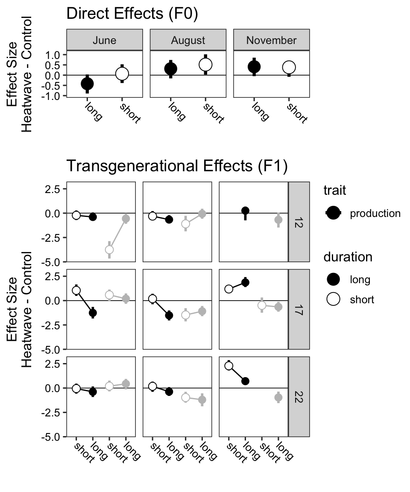
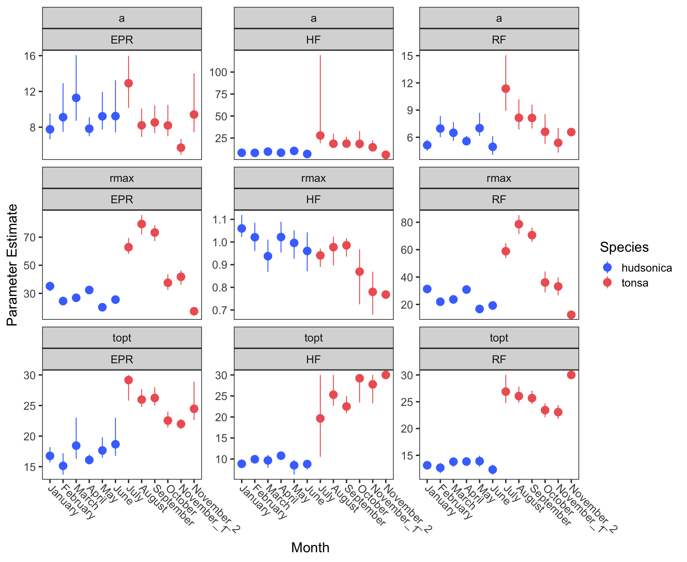

Figures for Seasonally variable thermal performance curves prevent
adverse effects of heatwaves
================

-   <a href="#main-text-figures" id="toc-main-text-figures">Main Text
    Figures</a>
-   <a href="#supplemental-information"
    id="toc-supplemental-information">Supplemental Information</a>

## Main Text Figures

## Supplemental Information

